# Immunogenicity and safety of coadministration of COVID-19 and influenza vaccination among healthcare workers


Isabell Wagenhäuser<sup>1,2</sup>; Julia Reusch<sup>1,2</sup>; Alexander Gabel, PhD<sup>1</sup>; Anna Höhn<sup>1</sup>; Thiên-Trí Lâm, MD<sup>3</sup>; Giovanni Almanzar, MD<sup>4</sup>; Martina Prelog, MD<sup>4</sup>; Lukas B. Krone, MD, PhD<sup>5,6</sup>; Anna Frey, MD<sup>2</sup>; Alexandra Schubert-Unkmeir, MD<sup>3</sup>; Lars Dölken, MD<sup>7</sup>; Stefan Frantz, MD<sup>2</sup>; Oliver Kurzai, MD<sup>3,8</sup>; Ulrich Vogel, MD<sup>1,3</sup>; Nils Petri, MD<sup>2\*</sup>; Manuel Krone, MD, MScPH<sup>1,3\*</sup> <br /><br />  

**Affiliations:** <br />

<sup>1</sup> Infection Control Unit, University Hospital Wuerzburg,
Wuerzburg, Germany<br /> 
<sup>2</sup> Department of Internal Medicine I,
University Hospital Wuerzburg, Wuerzburg, Germany<br /> 
<sup>3</sup>
Institute for Hygiene and Microbiology, University of Wuerzburg, Wuerzburg, Germany<br /> 
<sup>4</sup> Department of Paediatrics,
University of Wuerzburg, Wuerzburg, Germany<br /> 
<sup>5</sup>
Department of Physiology, Anatomy and Genetics, University of Oxford, Oxford, UK<br /> 
<sup>6</sup> University Hospital of Psychiatry and Psychotherapy, University of Bern, Bern, Switzerland<br /> 
<sup>7</sup> Institute for Virology and Immunobiology, University of Wuerzburg, Wuerzburg, Germany<br /> 
<sup>8</sup> Leibniz Institute for Natural Product Research and Infection Biology – Hans-Knoell-Institute, Jena, Germany <br /> 
<sup>\*</sup> both authors contributed equally


Reproducible Script
================

-   [Functions](#functions)
-   [External Packages and folder
    structure](#external-packages-and-folder-structure)
-   [Import data](#import-data)
-   [Data overview](#data-overview)
    -   [General](#general)
    -   [Separated by coadministration](#separated-by-coadministration)
    -   [Separated by Vaccination](#separated-by-vaccination)
    -   [Comparison time between serum and
        vaccination](#comparison-time-between-serum-and-vaccination)
    -   [Overview IgG concentrations](#overview-igg-concentrations)
    -   [Distribution of IgG titres](#distribution-of-igg-titres)
-   [Multiple regression analysis](#multiple-regression-analysis)
    -   [Check assumptions for multiple regression
        analysis](#check-assumptions-for-multiple-regression-analysis)
    -   [Coefficients of the multiple regression
        model](#coefficients-of-the-multiple-regression-model)
    -   [Posthoc tests: Pairwise comparisons within discrete
        factors](#posthoc-tests-pairwise-comparisons-within-discrete-factors)
    -   [Table IgG concentrations and statistical
        significance](#table-igg-concentrations-and-statistical-significance)
    -   [Coefficients pairwise comparisons
        (All)](#coefficients-pairwise-comparisons-all)
    -   [Comparison IgG titres based on vaccination
        concept](#comparison-igg-titres-based-on-vaccination-concept)
    -   [Comparison influential
        factors](#comparison-influential-factors)
    -   [Days between vaccination and serum
        sampling](#days-between-vaccination-and-serum-sampling)
-   [Side effects](#side-effects-1)
    -   [Coadministration irrespective of
        vaccination](#coadministration-irrespective-of-vaccination)
    -   [Coadministration regarding different COVID-19
        vaccines](#coadministration-regarding-different-covid-19-vaccines)

# Functions

``` r
med_iqr <- function(x){

  med_x <- round(median(x, na.rm = T), 1)
  iqr_x <- round(quantile(x, probs = c(0.25, 0.75), na.rm = T), 1)

  res <- "-"

  if(!is.na(med_x)){
    res <- paste0(med_x, " (", iqr_x[1], "-", iqr_x[2],")")
  }

  return(res)

}

number_percent <- function(df, gr1, gr2){

  df %>% group_by(!!sym(gr1), !!sym(gr2)) %>%
    summarise(n = n()) %>%
    mutate(perc = round(n/sum(n) * 100, 2)) %>%
    mutate(comb =  paste0(n, " (", perc,"%)")) %>%
    tidyr::pivot_wider(id_cols = c(gr1, gr2), names_from = gr1, values_from = "comb") %>%
    mutate(across(.cols = c(-!!sym(gr2)),.fns = function(x) replace(x, which(is.na(x)), "0 (0.00%)")))

}

number_percent_one_factor <- function(df, gr1){

  df %>% group_by(!!sym(gr1)) %>%
    summarise(n = n(), .groups = "drop") %>%
    mutate(perc = round(n/sum(n) * 100, 2)) %>%
    mutate(comb =  paste0(n, " (", perc,"%)")) %>%
    tidyr::pivot_wider(id_cols = c(gr1), names_from = gr1, values_from = "comb") #%>%
    # mutate(across(.cols = c(-!!sym(gr1)),.fns = function(x) replace(x, which(is.na(x)), "0 (0.00%)")))

}

mut_num_perc <- function(x, char_sel){
  
  abs <- sum(x == char_sel)
  rel <- round(abs/length(x)* 100, digits = 2)
  
  return(paste0(abs, " (", rel, "%)"))
}

fisher_test_table <- function(df, gr_row, gr_col){
  
  ft_table <- df %>% group_by(!!sym(gr_row), !!sym(gr_col)) %>% count(name = "Number of Subjects") %>% 
            tidyr::pivot_wider(id_cols = c(gr_col, "Number of Subjects"), names_from = gr_row, values_from = "Number of Subjects") 

  ft_res <- fisher.test(ft_table[,-1])

  kable_table <- df %>%  group_by(!!sym(gr_row), !!sym(gr_col)) %>% count(name = "n") %>% 
            group_by(!!sym(gr_col)) %>% mutate(val = paste0(n, " (", round(n/sum(n) * 100, 2), "%)" )) %>%
            tidyr::pivot_wider(id_cols = c(gr_row, "val", gr_col), names_from = gr_col, values_from = "val")

  kable_table <- cbind(kable_table, "Odds-Ratio" = round(ft_res$estimate, 2), "P-value" = ft_res$p.value)
  
  kable_table <- kable_table %>% mutate(`P-value` = dplyr::case_when(
                                                  `P-value` >= 0.01 ~ as.character(round(`P-value`, 2)),
                                                  `P-value` < 0.0001 ~ "< 0.0001",
                                                  `P-value` < 0.001 ~ "< 0.001",
                                                  `P-value` < 0.01 ~ "< 0.01")) 
  knitr::kable(kable_table, align = "c") %>%
    kableExtra::kable_styling(full_width = F, position = "left")%>%
    kableExtra::column_spec(1, bold = T) %>%
    kableExtra::collapse_rows(columns = 3:5, valign = "middle")
}

chisq_test_table <- function(df, gr_row, gr_col){
  
  chi_table <- df %>% group_by(!!sym(gr_row), !!sym(gr_col)) %>% count(name = "Number of Subjects") %>% 
            tidyr::pivot_wider(id_cols = c(gr_row, "Number of Subjects"), names_from = gr_col, values_from = "Number of Subjects")

  chisq_res <- chisq.test(chi_table[,-1])

  kable_table <- df %>% group_by(!!sym(gr_row), !!sym(gr_col)) %>% count(name = "n") %>% 
            group_by(!!sym(gr_col)) %>% mutate(val = paste0(n, " (", round(n/sum(n) * 100, 2), "%)" )) %>%
            tidyr::pivot_wider(id_cols = c(gr_row, "val", gr_col), names_from = gr_col, values_from = "val")

  knitr::kable(cbind(kable_table, "Odds-Ratio" =  "-", "P-value" = round(chisq_res$p.value, 2)), align = "c") %>%
    kableExtra::kable_styling(full_width = F, position = "left")%>%
    kableExtra::column_spec(1, bold = T) %>%
    kableExtra::collapse_rows(columns = dim(kable_table)[2]:(dim(kable_table)[2] + 2), valign = "middle")
}

model_specifics <- function(model, data){
  
  prds <- model %>% predict(data) 
  rmse <- caret::RMSE(prds, data$logIgG)
  r2 <- caret::R2(prds, data$logIgG)
  
  list(RMSE = rmse, R2 = r2)
  
}


fisher_tests_gr <- function(df, gr1, var_expr){

  df_subset <- df %>% select(!!sym(gr1), dplyr::matches(var_expr)) %>% na.omit()
  fisher_tests <- c()

  for(nw in colnames(df_subset %>% select(dplyr::matches(var_expr)))){

    conf_mat <- df_subset %>% dplyr::group_by(!!sym(gr1), !!sym(nw)) %>% 
                               count(name = "n") %>% ungroup() %>% 
                               tidyr::pivot_wider(id_cols = c(gr1, nw), values_from = c("n"), names_from = c(nw))
  
    fisher_res <-  broom::tidy(fisher.test(conf_mat[,-1], alternative = "two.sided"))
  
    colnames(conf_mat)[-1] <- c("gr2.1", "gr2.2")
    fisher_tests <- rbind(fisher_tests, cbind(group1 = conf_mat %>% pull(!!sym(gr1)) %>% as.character(), group2 = nw, conf_mat[,-1], fisher_res))
  }

  return(fisher_tests)
}

fisher_plot_odds <- function(fisher_test_df, ylab_add = "Coadministration", wrap = F, ylim = NULL){
  
  fisher_plt_df <- fisher_test_df %>%
                   select(group2, estimate, matches("conf|super"), p.value) %>%
                   unique() %>% mutate(p.adj = p.adjust(p.value, "BY"))
  
  odds_plot <- ggplot2::ggplot(data = fisher_plt_df, ggplot2::aes(x = group2, y = estimate))
  
  if(wrap){
    odds_plot <- odds_plot + ggplot2::facet_wrap(~super_group, nrow = 2)
  }
  odds_plot <- odds_plot + 
               ggplot2::geom_point(cex = 3) +
               ggplot2::geom_errorbar(ggplot2::aes(ymin = conf.low, ymax = conf.high), width = 0.5,
                                      position = ggplot2::position_dodge2(), show.legend = FALSE) +
               ggplot2::theme_bw() +
               ggplot2::scale_x_discrete(labels = c("Local reactions", "Headache", "Muscle Pain", "Fever and/or Chills", "Fatigue", "Other s.e.")) +
               ggsci::scale_color_nejm() +
               ggplot2::theme(axis.text = ggplot2::element_text(size = 12, colour = "black"),
                              axis.text.x = ggplot2::element_text(angle = 45, hjust = 1),
                              axis.title = ggplot2::element_text(face = "bold", size = 14),
                              legend.title = ggplot2::element_blank(),
                              legend.text = ggplot2::element_text(size = 12),
                              legend.position = "bottom",
                              strip.text = ggplot2::element_text(size = 14, face = "bold"), 
                              strip.background = ggplot2::element_rect(fill = "white"))+
               ggplot2::ylab(paste0("OR ", ylab_add)) +
               ggplot2::xlab("side effects")
  
  if(!is.null(ylim)){
    
    odds_plot <- odds_plot + ggplot2::ylim(ylim)
  }
  
  if(dim( fisher_plt_df %>% filter(p.adj < 0.05))[1] > 0){
     odds_plot <- odds_plot +  ggplot2::geom_text(data = fisher_plt_df %>% filter(p.adj < 0.05), ggplot2::aes(x = group2, y = conf.high, label = paste0("italic(p)== ",round(p.adj, 2))), vjust = -0.5, parse = T)
  }
  
  odds_plot
}


barplot_sideeffects_percentage <- function(p.adj_fisher_tests_df, wrap = F){
  
  plt_df <- c()
  
  if(wrap){
    plt_df <- p.adj_fisher_tests_df %>% group_by(super_group, group1, group2) %>% 
              mutate(n =  gr2.1 + gr2.2,
                     percentage = round(gr2.1/n * 100, 2)) %>% 
                     select(group1, group2, percentage, p.adjusted)
  }else{
    
    plt_df <- p.adj_fisher_tests_df %>% group_by(group1, group2) %>% 
              mutate(n =  gr2.1 + gr2.2,
                     percentage = round(gr2.1/n * 100, 2)) %>% 
                     select(group1, group2, percentage, p.adjusted)
  }
  
  p_val_data <- plt_df %>% mutate(group1 = plt_df$group1[1]) %>% 
                select(group2, p.adjusted, percentage)  %>% 
                mutate(percentage = max(percentage)) %>% 
                unique() %>% ungroup()
  
  bar_plt <- ggplot2::ggplot(data = plt_df, ggplot2::aes(x = group2, y = percentage, fill = group1))

  if(wrap){
    
    bar_plt <- bar_plt + ggplot2::facet_wrap(~super_group, nrow = 2)
  }

  bar_plt <- bar_plt + 
             ggplot2::geom_bar(stat = "identity", position = ggplot2::position_dodge2()) +
             ggplot2::xlab("Side effects") +
             ggplot2::ylab("Percentage of participants") +
             ggplot2::theme_bw() +
             ggsci::scale_fill_nejm() +
             ggplot2::scale_x_discrete(labels = c("Local reactions",
                                                  "Headache", "Muscle Pain", "Fever and/or Chills", "Fatigue", "Other")) +
             ggplot2::scale_y_continuous(expand = c(0,1), limits = c(0,100)) +
             ggplot2::guides(fill = ggplot2::guide_legend(title = "Effect")) +
             ggplot2::theme(axis.title = ggplot2::element_text(color = "black", size = 13, face = "bold"),
                            axis.text = ggplot2::element_text(color = "black", size = 12),
                            axis.text.x = ggplot2::element_text(angle = 45, hjust = 1, vjust = 1),
                            strip.text = ggplot2::element_text(size = 14, face = "bold"), 
                            strip.background = ggplot2::element_rect(fill = "white"),
                            legend.title = ggplot2::element_blank(),
                            legend.text = ggplot2::element_text(size = 10),
                            axis.title.x = ggplot2::element_blank(),
                            legend.position = "bottom",
                            legend.justification = c("left", "top"),
                            legend.box.just = "left",
                            legend.margin = ggplot2::margin(6, 6, 6, 6),
                            legend.background = ggplot2::element_rect(fill = NA))+
              ggplot2::geom_text(data = p_val_data,
                            mapping = ggplot2::aes(x = group2, y = percentage + 1, label = paste0("italic(p)== ", round(p.adjusted, digits = 3))),
                            hjust   = 0.5, vjust = 0, size = 4, parse = T)
  
  bar_plt
}
```

# External Packages and folder structure

``` r
library(dplyr)
library(ggplot2)
library(lubridate)
library(glmnet)
library(emmeans)
library(knitr)  # required for kable
library(kableExtra)  # required for kableExtra

# required libraries:
# ggstance
# broom.mixed
# jtools
# effects
# sjPlot
# rstatix

super_dir <- "./"
plot.dir <- file.path(super_dir, "plots")
data.dir <- file.path(super_dir, "data")

if(!file.exists(data.dir)){
  dir.create(data.dir, recursive = T)
}

for(plt_format in c("png", "pdf", "svg")){

  if(!file.exists(file.path(plot.dir, plt_format))){
    dir.create(file.path(plot.dir, plt_format), recursive = T)
  }
}
```

# Import data

``` r
df_coad <- readRDS(file.path(data.dir, "covacser_data_coadministration.rds"))
```

# Data overview

## General

### Total

<table class=" lightable-paper table" style="font-family: &quot;Arial Narrow&quot;, arial, helvetica, sans-serif; margin-left: auto; margin-right: auto; ">
<thead>
<tr>
<th style="text-align:left;">
Feature
</th>
<th style="text-align:left;">
Stats
</th>
</tr>
</thead>
<tbody>
<tr>
<td style="text-align:left;font-weight: bold;">
Number of Subjects
</td>
<td style="text-align:left;">
1231
</td>
</tr>
<tr>
<td style="text-align:left;font-weight: bold;">
Age
</td>
<td style="text-align:left;">
41 (30-53)
</td>
</tr>
<tr>
<td style="text-align:left;font-weight: bold;">
Weight
</td>
<td style="text-align:left;">
69 (60-80)
</td>
</tr>
<tr>
<td style="text-align:left;font-weight: bold;">
Height
</td>
<td style="text-align:left;">
169 (164-175)
</td>
</tr>
<tr>
<td style="text-align:left;font-weight: bold;">
BMI
</td>
<td style="text-align:left;">
23.8 (21.6-27.1)
</td>
</tr>
<tr>
<td style="text-align:left;font-weight: bold;">
Smoking
</td>
<td style="text-align:left;">
150 (12.19%)
</td>
</tr>
<tr>
<td style="text-align:left;font-weight: bold;">
Side effects
</td>
<td style="text-align:left;">
1059 (86.03%)
</td>
</tr>
<tr>
<td style="text-align:left;font-weight: bold;">
Immune deficiency
</td>
<td style="text-align:left;">
30 (2.44%)
</td>
</tr>
<tr>
<td style="text-align:left;font-weight: bold;">
Days_Vacc_12
</td>
<td style="text-align:left;">
21 (21-21)
</td>
</tr>
<tr>
<td style="text-align:left;font-weight: bold;">
Days_Vacc_23
</td>
<td style="text-align:left;">
266 (241-290)
</td>
</tr>
<tr>
<td style="text-align:left;font-weight: bold;">
Days_Vacc3_Serum
</td>
<td style="text-align:left;">
18 (15-24)
</td>
</tr>
<tr>
<td style="text-align:left;font-weight: bold;">
BNT162b2mRNA
</td>
<td style="text-align:left;">
996 (80.91%)
</td>
</tr>
<tr>
<td style="text-align:left;font-weight: bold;">
mRNA-1273
</td>
<td style="text-align:left;">
235 (19.09%)
</td>
</tr>
<tr>
<td style="text-align:left;font-weight: bold;">
Coadministration
</td>
<td style="text-align:left;">
249 (20.23%)
</td>
</tr>
<tr>
<td style="text-align:left;font-weight: bold;">
IgG
</td>
<td style="text-align:left;">
2008 (1268.8-3082.1)
</td>
</tr>
</tbody>
</table>

### Grouping by gender

<table class=" lightable-paper table" style="font-family: &quot;Arial Narrow&quot;, arial, helvetica, sans-serif; margin-left: auto; margin-right: auto; ">
<thead>
<tr>
<th style="text-align:left;">
Feature
</th>
<th style="text-align:left;">
female
</th>
<th style="text-align:left;">
male
</th>
</tr>
</thead>
<tbody>
<tr>
<td style="text-align:left;font-weight: bold;">
Number of Subjects
</td>
<td style="text-align:left;">
1015 (82%)
</td>
<td style="text-align:left;">
216 (18%)
</td>
</tr>
<tr>
<td style="text-align:left;font-weight: bold;">
Age
</td>
<td style="text-align:left;">
41 (30-53)
</td>
<td style="text-align:left;">
40.5 (32-50)
</td>
</tr>
<tr>
<td style="text-align:left;font-weight: bold;">
Weight
</td>
<td style="text-align:left;">
66 (59-76)
</td>
<td style="text-align:left;">
82 (73.8-92)
</td>
</tr>
<tr>
<td style="text-align:left;font-weight: bold;">
Height
</td>
<td style="text-align:left;">
168 (163-172)
</td>
<td style="text-align:left;">
180 (176-185)
</td>
</tr>
<tr>
<td style="text-align:left;font-weight: bold;">
BMI
</td>
<td style="text-align:left;">
23.6 (21.3-27)
</td>
<td style="text-align:left;">
24.6 (22.7-27.5)
</td>
</tr>
<tr>
<td style="text-align:left;font-weight: bold;">
Smoking
</td>
<td style="text-align:left;">
122 (12.02%)
</td>
<td style="text-align:left;">
28 (12.96%)
</td>
</tr>
<tr>
<td style="text-align:left;font-weight: bold;">
Side effects
</td>
<td style="text-align:left;">
887 (87.39%)
</td>
<td style="text-align:left;">
172 (79.63%)
</td>
</tr>
<tr>
<td style="text-align:left;font-weight: bold;">
Immune deficient
</td>
<td style="text-align:left;">
29 (2.86%)
</td>
<td style="text-align:left;">
1 (0.46%)
</td>
</tr>
<tr>
<td style="text-align:left;font-weight: bold;">
Days_Vacc_12
</td>
<td style="text-align:left;">
21 (21-21)
</td>
<td style="text-align:left;">
21 (21-22)
</td>
</tr>
<tr>
<td style="text-align:left;font-weight: bold;">
Days_Vacc_23
</td>
<td style="text-align:left;">
265 (239-289)
</td>
<td style="text-align:left;">
274.5 (249.2-293)
</td>
</tr>
<tr>
<td style="text-align:left;font-weight: bold;">
Days_Vacc3_Serum
</td>
<td style="text-align:left;">
18 (15-24)
</td>
<td style="text-align:left;">
18 (15-24)
</td>
</tr>
<tr>
<td style="text-align:left;font-weight: bold;">
BNT162b2mRNA
</td>
<td style="text-align:left;">
812 (80%)
</td>
<td style="text-align:left;">
184 (85.19%)
</td>
</tr>
<tr>
<td style="text-align:left;font-weight: bold;">
mRNA-1273
</td>
<td style="text-align:left;">
203 (20%)
</td>
<td style="text-align:left;">
32 (14.81%)
</td>
</tr>
<tr>
<td style="text-align:left;font-weight: bold;">
Coadministration
</td>
<td style="text-align:left;">
187 (18.42%)
</td>
<td style="text-align:left;">
62 (28.7%)
</td>
</tr>
<tr>
<td style="text-align:left;font-weight: bold;">
IgG
</td>
<td style="text-align:left;">
2024.4 (1287.3-3082.1)
</td>
<td style="text-align:left;">
1980.8 (1157.2-3029.7)
</td>
</tr>
</tbody>
</table>

## Separated by coadministration

### Total

<table class=" lightable-paper table" style="font-family: &quot;Arial Narrow&quot;, arial, helvetica, sans-serif; margin-left: auto; margin-right: auto; ">
<thead>
<tr>
<th style="text-align:left;">
Feature
</th>
<th style="text-align:left;">
Coadministration
</th>
<th style="text-align:left;">
No Coadministration
</th>
<th style="text-align:right;">
p
</th>
<th style="text-align:right;">
p.adjust
</th>
</tr>
</thead>
<tbody>
<tr>
<td style="text-align:left;font-weight: bold;">
Number of Subjects
</td>
<td style="text-align:left;">
249 (20%)
</td>
<td style="text-align:left;">
982 (80%)
</td>
<td style="text-align:right;">
NA
</td>
<td style="text-align:right;">
NA
</td>
</tr>
<tr>
<td style="text-align:left;font-weight: bold;">
age
</td>
<td style="text-align:left;">
38 (30-51)
</td>
<td style="text-align:left;">
41 (31-53)
</td>
<td style="text-align:right;">
0.08760
</td>
<td style="text-align:right;">
0.3974850
</td>
</tr>
<tr>
<td style="text-align:left;font-weight: bold;">
weight
</td>
<td style="text-align:left;">
70 (62-83)
</td>
<td style="text-align:left;">
68 (60-80)
</td>
<td style="text-align:right;">
0.02560
</td>
<td style="text-align:right;">
0.1548800
</td>
</tr>
<tr>
<td style="text-align:left;font-weight: bold;">
height
</td>
<td style="text-align:left;">
170 (165-176)
</td>
<td style="text-align:left;">
168 (164-174)
</td>
<td style="text-align:right;">
0.00307
</td>
<td style="text-align:right;">
0.0557205
</td>
</tr>
<tr>
<td style="text-align:left;font-weight: bold;">
bmi
</td>
<td style="text-align:left;">
23.8 (21.7-27.3)
</td>
<td style="text-align:left;">
23.8 (21.5-27.1)
</td>
<td style="text-align:right;">
0.53100
</td>
<td style="text-align:right;">
1.0000000
</td>
</tr>
<tr>
<td style="text-align:left;font-weight: bold;">
gender
</td>
<td style="text-align:left;">
187 (75.1%)
</td>
<td style="text-align:left;">
828 (84.32%)
</td>
<td style="text-align:right;">
NA
</td>
<td style="text-align:right;">
NA
</td>
</tr>
<tr>
<td style="text-align:left;font-weight: bold;">
smoking
</td>
<td style="text-align:left;">
32 (12.85%)
</td>
<td style="text-align:left;">
118 (12.02%)
</td>
<td style="text-align:right;">
NA
</td>
<td style="text-align:right;">
NA
</td>
</tr>
<tr>
<td style="text-align:left;font-weight: bold;">
Side effects
</td>
<td style="text-align:left;">
202 (81.12%)
</td>
<td style="text-align:left;">
857 (87.27%)
</td>
<td style="text-align:right;">
NA
</td>
<td style="text-align:right;">
NA
</td>
</tr>
<tr>
<td style="text-align:left;font-weight: bold;">
Immune deficiency
</td>
<td style="text-align:left;">
3 (1.2%)
</td>
<td style="text-align:left;">
27 (2.75%)
</td>
<td style="text-align:right;">
NA
</td>
<td style="text-align:right;">
NA
</td>
</tr>
<tr>
<td style="text-align:left;font-weight: bold;">
days_vacc12
</td>
<td style="text-align:left;">
21 (21-21)
</td>
<td style="text-align:left;">
21 (21-21)
</td>
<td style="text-align:right;">
0.52700
</td>
<td style="text-align:right;">
1.0000000
</td>
</tr>
<tr>
<td style="text-align:left;font-weight: bold;">
days_vacc23
</td>
<td style="text-align:left;">
260 (231-288)
</td>
<td style="text-align:left;">
267 (243-290.8)
</td>
<td style="text-align:right;">
0.01870
</td>
<td style="text-align:right;">
0.1548800
</td>
</tr>
<tr>
<td style="text-align:left;font-weight: bold;">
time_serum_coadmin
</td>
<td style="text-align:left;">
18 (15-24)
</td>
<td style="text-align:left;">
18 (15-24)
</td>
<td style="text-align:right;">
0.67200
</td>
<td style="text-align:right;">
1.0000000
</td>
</tr>
<tr>
<td style="text-align:left;font-weight: bold;">
BNT162b2mRNA
</td>
<td style="text-align:left;">
225 (90.36%)
</td>
<td style="text-align:left;">
771 (78.51%)
</td>
<td style="text-align:right;">
NA
</td>
<td style="text-align:right;">
NA
</td>
</tr>
<tr>
<td style="text-align:left;font-weight: bold;">
mRNA-1273
</td>
<td style="text-align:left;">
24 (9.64%)
</td>
<td style="text-align:left;">
211 (21.49%)
</td>
<td style="text-align:right;">
NA
</td>
<td style="text-align:right;">
NA
</td>
</tr>
<tr>
<td style="text-align:left;font-weight: bold;">
IgG
</td>
<td style="text-align:left;">
1605 (1078-2504.7)
</td>
<td style="text-align:left;">
2150.2 (1341.1-3242.3)
</td>
<td style="text-align:right;">
NA
</td>
<td style="text-align:right;">
NA
</td>
</tr>
</tbody>
</table>

### Third Vaccine

``` r
fisher_test_table(df = df_coad, gr_col = "coadmin", gr_row = "vaccine")
```

<table class="table" style="width: auto !important; ">
<thead>
<tr>
<th style="text-align:center;">
vaccine
</th>
<th style="text-align:center;">
Coadministration
</th>
<th style="text-align:center;">
No Coadministration
</th>
<th style="text-align:center;">
Odds-Ratio
</th>
<th style="text-align:center;">
P-value
</th>
</tr>
</thead>
<tbody>
<tr>
<td style="text-align:center;font-weight: bold;">
BNT162b2mRNA
</td>
<td style="text-align:center;">
225 (90.36%)
</td>
<td style="text-align:center;">
771 (78.51%)
</td>
<td style="text-align:center;vertical-align: middle !important;" rowspan="2">
2.56
</td>
<td style="text-align:center;vertical-align: middle !important;" rowspan="2">
\< 0.0001
</td>
</tr>
<tr>
<td style="text-align:center;font-weight: bold;">
mRNA-1273
</td>
<td style="text-align:center;">
24 (9.64%)
</td>
<td style="text-align:center;">
211 (21.49%)
</td>
</tr>
</tbody>
</table>

### Gender

``` r
fisher_test_table(df = df_coad, gr_col = "coadmin", gr_row = "gender")
```

<table class="table" style="width: auto !important; ">
<thead>
<tr>
<th style="text-align:center;">
gender
</th>
<th style="text-align:center;">
Coadministration
</th>
<th style="text-align:center;">
No Coadministration
</th>
<th style="text-align:center;">
Odds-Ratio
</th>
<th style="text-align:center;">
P-value
</th>
</tr>
</thead>
<tbody>
<tr>
<td style="text-align:center;font-weight: bold;">
female
</td>
<td style="text-align:center;">
187 (75.1%)
</td>
<td style="text-align:center;">
828 (84.32%)
</td>
<td style="text-align:center;vertical-align: middle !important;" rowspan="2">
0.56
</td>
<td style="text-align:center;vertical-align: middle !important;" rowspan="2">
\< 0.01
</td>
</tr>
<tr>
<td style="text-align:center;font-weight: bold;">
male
</td>
<td style="text-align:center;">
62 (24.9%)
</td>
<td style="text-align:center;">
154 (15.68%)
</td>
</tr>
</tbody>
</table>

### Smoking

``` r
fisher_test_table(df = df_coad, gr_col = "coadmin", gr_row = "smoking")
```

<table class="table" style="width: auto !important; ">
<thead>
<tr>
<th style="text-align:center;">
smoking
</th>
<th style="text-align:center;">
Coadministration
</th>
<th style="text-align:center;">
No Coadministration
</th>
<th style="text-align:center;">
Odds-Ratio
</th>
<th style="text-align:center;">
P-value
</th>
</tr>
</thead>
<tbody>
<tr>
<td style="text-align:center;font-weight: bold;">
smoker
</td>
<td style="text-align:center;">
32 (12.85%)
</td>
<td style="text-align:center;">
118 (12.02%)
</td>
<td style="text-align:center;vertical-align: middle !important;" rowspan="2">
1.08
</td>
<td style="text-align:center;vertical-align: middle !important;" rowspan="2">
0.74
</td>
</tr>
<tr>
<td style="text-align:center;font-weight: bold;">
non-smoker
</td>
<td style="text-align:center;">
217 (87.15%)
</td>
<td style="text-align:center;">
864 (87.98%)
</td>
</tr>
</tbody>
</table>

### Risk

``` r
chisq_test_table(df = df_coad, gr_col = "coadmin", gr_row = "risk")
```

<table class="table" style="width: auto !important; ">
<thead>
<tr>
<th style="text-align:center;">
risk
</th>
<th style="text-align:center;">
Coadministration
</th>
<th style="text-align:center;">
No Coadministration
</th>
<th style="text-align:center;">
Odds-Ratio
</th>
<th style="text-align:center;">
P-value
</th>
</tr>
</thead>
<tbody>
<tr>
<td style="text-align:center;font-weight: bold;">
false
</td>
<td style="text-align:center;">
156 (62.65%)
</td>
<td style="text-align:center;">
581 (59.16%)
</td>
<td style="text-align:center;vertical-align: middle !important;" rowspan="5">

-   </td>
    <td style="text-align:center;vertical-align: middle !important;" rowspan="5">
    0.41
    </td>
    </tr>
    <tr>
    <td style="text-align:center;font-weight: bold;">
    rather false
    </td>
    <td style="text-align:center;">
    59 (23.69%)
    </td>
    <td style="text-align:center;">
    237 (24.13%)
    </td>
    </tr>
    <tr>
    <td style="text-align:center;font-weight: bold;">
    partly
    </td>
    <td style="text-align:center;">
    24 (9.64%)
    </td>
    <td style="text-align:center;">
    100 (10.18%)
    </td>
    </tr>
    <tr>
    <td style="text-align:center;font-weight: bold;">
    rather true
    </td>
    <td style="text-align:center;">
    5 (2.01%)
    </td>
    <td style="text-align:center;">
    46 (4.68%)
    </td>
    </tr>
    <tr>
    <td style="text-align:center;font-weight: bold;">
    true
    </td>
    <td style="text-align:center;">
    5 (2.01%)
    </td>
    <td style="text-align:center;">
    18 (1.83%)
    </td>
    </tr>
    </tbody>
    </table>

### Side effects

``` r
fisher_test_table(df = df_coad, gr_col = "coadmin", gr_row = "sideeffects")
```

<table class="table" style="width: auto !important; ">
<thead>
<tr>
<th style="text-align:center;">
sideeffects
</th>
<th style="text-align:center;">
Coadministration
</th>
<th style="text-align:center;">
No Coadministration
</th>
<th style="text-align:center;">
Odds-Ratio
</th>
<th style="text-align:center;">
P-value
</th>
</tr>
</thead>
<tbody>
<tr>
<td style="text-align:center;font-weight: bold;">
TRUE
</td>
<td style="text-align:center;">
202 (81.12%)
</td>
<td style="text-align:center;">
857 (87.27%)
</td>
<td style="text-align:center;vertical-align: middle !important;" rowspan="2">
0.63
</td>
<td style="text-align:center;vertical-align: middle !important;" rowspan="2">
0.02
</td>
</tr>
<tr>
<td style="text-align:center;font-weight: bold;">
FALSE
</td>
<td style="text-align:center;">
47 (18.88%)
</td>
<td style="text-align:center;">
125 (12.73%)
</td>
</tr>
</tbody>
</table>

### Immune system

<table class="table" style="width: auto !important; ">
<thead>
<tr>
<th style="text-align:center;">
immune system
</th>
<th style="text-align:center;">
Coadministration
</th>
<th style="text-align:center;">
No Coadministration
</th>
<th style="text-align:center;">
Odds-Ratio
</th>
<th style="text-align:center;">
P-value
</th>
</tr>
</thead>
<tbody>
<tr>
<td style="text-align:center;font-weight: bold;">
deficient
</td>
<td style="text-align:center;">
3 (1.2%)
</td>
<td style="text-align:center;">
27 (2.75%)
</td>
<td style="text-align:center;vertical-align: middle !important;" rowspan="2">
0.43
</td>
<td style="text-align:center;vertical-align: middle !important;" rowspan="2">
0.25
</td>
</tr>
<tr>
<td style="text-align:center;font-weight: bold;">
competent
</td>
<td style="text-align:center;">
246 (98.8%)
</td>
<td style="text-align:center;">
955 (97.25%)
</td>
</tr>
</tbody>
</table>

### Plots: Age

``` r
df_coad %>% ggplot2::ggplot(ggplot2::aes(x = age)) +
  ggplot2::facet_wrap(~coadmin) +
  ggplot2::geom_histogram(bins = 40, col = "black") +
  ggplot2::xlab("Age of subjects") +
  ggplot2::ylab("Number of subjects") +
  ggplot2::theme_bw() +
  ggplot2::theme(axis.text = ggplot2::element_text(size = 12),
                 axis.title = ggplot2::element_text(face = "bold"),
                 strip.text = ggplot2::element_text(face = "bold", size = 12)) +
  ggplot2::geom_text(data = df_coad %>% group_by(coadmin) %>% count(),
                     mapping = ggplot2::aes(x = 45, y = 50, label = paste0("Subjects: ",n)),
                     hjust   = 0.5,
                     vjust   = 0, size = 4) +
  ggplot2::geom_text(data = df_coad %>% group_by(coadmin) %>% summarise(age = median(age)),
                     mapping = ggplot2::aes(x = 45, y = 45, label = paste0("Median Age: ",round(age))),
                     hjust   = 0.5,
                     vjust   = 0, size = 4)
```

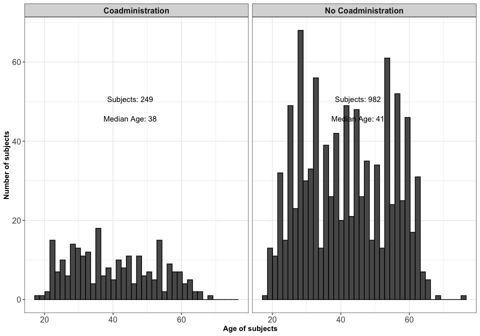<!-- -->

``` r
ggsave(filename = file.path(plot.dir,"Histogramm_Altersverteilung.pdf"), device = "pdf", width = 6, height = 5)
ggsave(filename = file.path(plot.dir,"svg/Histogramm_Altersverteilung.svg"), device = "svg", width = 6, height = 5)
```

## Separated by Vaccination

<table class=" lightable-paper" style="font-family: &quot;Arial Narrow&quot;, arial, helvetica, sans-serif; margin-left: auto; margin-right: auto;">
<thead>
<tr>
<th style="text-align:left;">
Feature
</th>
<th style="text-align:left;">
BNT162b2mRNA
</th>
<th style="text-align:left;">
mRNA-1273
</th>
</tr>
</thead>
<tbody>
<tr>
<td style="text-align:left;">
N
</td>
<td style="text-align:left;">
996 (81%)
</td>
<td style="text-align:left;">
235 (19%)
</td>
</tr>
<tr>
<td style="text-align:left;">
Age
</td>
<td style="text-align:left;">
38.5 (29-52)
</td>
<td style="text-align:left;">
46 (39-55)
</td>
</tr>
<tr>
<td style="text-align:left;">
Weight
</td>
<td style="text-align:left;">
69 (60-80)
</td>
<td style="text-align:left;">
68 (60-79)
</td>
</tr>
<tr>
<td style="text-align:left;">
Height
</td>
<td style="text-align:left;">
169 (164-175)
</td>
<td style="text-align:left;">
168 (164-173)
</td>
</tr>
<tr>
<td style="text-align:left;">
BMI
</td>
<td style="text-align:left;">
23.8 (21.6-27.1)
</td>
<td style="text-align:left;">
23.8 (21.5-27)
</td>
</tr>
<tr>
<td style="text-align:left;">
Gender (female)
</td>
<td style="text-align:left;">
812 (81.53%)
</td>
<td style="text-align:left;">
203 (86.38%)
</td>
</tr>
<tr>
<td style="text-align:left;">
Smoking
</td>
<td style="text-align:left;">
127 (12.75%)
</td>
<td style="text-align:left;">
23 (9.79%)
</td>
</tr>
<tr>
<td style="text-align:left;">
Days_Vacc_12
</td>
<td style="text-align:left;">
21 (21-21)
</td>
<td style="text-align:left;">
21 (21-21)
</td>
</tr>
<tr>
<td style="text-align:left;">
Days_Vacc_23
</td>
<td style="text-align:left;">
267 (242-290)
</td>
<td style="text-align:left;">
265 (237-294)
</td>
</tr>
<tr>
<td style="text-align:left;">
Days_Vacc3_Serum
</td>
<td style="text-align:left;">
18 (15-22)
</td>
<td style="text-align:left;">
21 (16-27)
</td>
</tr>
<tr>
<td style="text-align:left;">
Coadministration
</td>
<td style="text-align:left;">
225 (22.59%)
</td>
<td style="text-align:left;">
24 (10.21%)
</td>
</tr>
<tr>
<td style="text-align:left;">
IgG
</td>
<td style="text-align:left;">
1888.4 (1192.6-2916.8)
</td>
<td style="text-align:left;">
2655.8 (1698.7-3987.9)
</td>
</tr>
</tbody>
</table>

### Vaccine: relative frequencies

``` r
df_coad %>% group_by(coadmin, vaccine) %>% count() %>% group_by(coadmin) %>% mutate(n = n/sum(n)) %>%
  ggplot2::ggplot(ggplot2::aes(x = vaccine, y = n, fill = coadmin)) +
  ggplot2::geom_bar(stat = "identity", position = ggplot2::position_dodge()) +
  ggplot2::xlab("Vaccine") +
  ggplot2::ylab("relative frequency of subjects") +
  ggplot2::theme_bw() +
  ggsci::scale_fill_nejm()+
  ggplot2::theme(axis.text = ggplot2::element_text(size = 12, colour = "black"),
                 axis.title = ggplot2::element_text(face = "bold", size = 14),
                 legend.title = ggplot2::element_blank(),
                 legend.text = ggplot2::element_text(size = 12),
                 legend.position = "bottom") +
  ggplot2::guides(color = ggplot2::guide_legend(override.aes = list(shape = 22, size = 8, stroke = 1), ncol = 2))
```

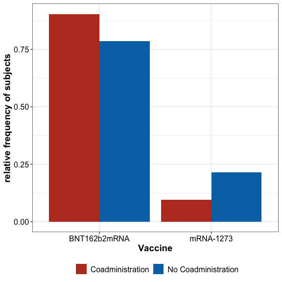<!-- -->

``` r
ggsave(filename = file.path(plot.dir,"png/Barplot_Vaccine.png"), device = "png", width = 6, height = 6, dpi = 300)
ggsave(filename = file.path(plot.dir,"svg/Barplot_Vaccine.svg"), device = "svg", width = 6, height = 6, dpi = 300)
```

### Vaccination date

``` r
df_coad %>%
  ggplot2::ggplot(ggplot2::aes(y = coadmin, x = date_vacc3, col = vaccine)) +
  ggplot2::geom_point(position=ggplot2::position_jitterdodge(jitter.height = 0.2)) +
  ggplot2::theme_bw() +
  ggplot2::ylab("") +
  ggplot2::xlab("Date of vaccination") +
  ggsci::scale_color_nejm() +
  ggplot2::theme(axis.text = ggplot2::element_text(size = 12, colour = "black"),
                 axis.text.x = ggplot2::element_text(angle = 45, vjust = 1, hjust = 1),
                 axis.title = ggplot2::element_text(face = "bold", size = 14),
                 legend.title = ggplot2::element_blank(),
                 legend.text = ggplot2::element_text(size = 12),
                 legend.position = "bottom") +
  ggplot2::guides(color = ggplot2::guide_legend(override.aes = list(shape = 20, size = 8, stroke = 1), ncol = 2))
```

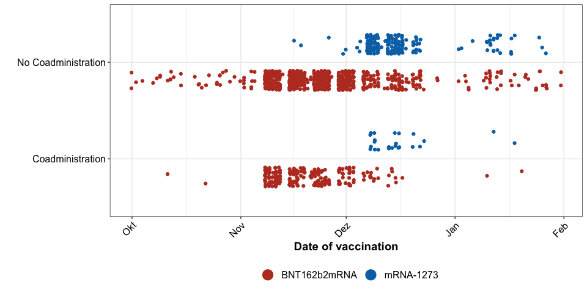<!-- -->

``` r
ggsave(filename = file.path(plot.dir,"png/Impfdaten_Vakzin_scatter.png"), device = "png", width = 6, height = 6, dpi = 300)
ggsave(filename = file.path(plot.dir,"svg/Impfdaten_Vakzin_scatter.svg"), device = "svg", width = 6, height = 6, dpi = 300)
```

## Comparison time between serum and vaccination

``` r
gr_stats <- rbind(df_coad %>% group_by(vaccine) %>% summarise("Med ± IQR" = med_iqr(time_serum_coadmin)) %>% rename(gr = "vaccine"),
                  df_coad %>% group_by(coadmin) %>% summarise("Med ± IQR" = med_iqr(time_serum_coadmin)) %>% rename(gr = "coadmin"),
                  df_coad %>% group_by(vaccine, coadmin) %>% summarise("Med ± IQR" = med_iqr(time_serum_coadmin)) %>%
                              mutate(gr = paste0(vaccine, ":", coadmin)) %>% ungroup() %>% select(-vaccine, -coadmin))

time_test_table <- rbind(df_coad %>% rstatix::wilcox_test(time_serum_coadmin ~ vaccine) %>% select(-.y.),
      df_coad %>% rstatix::wilcox_test(time_serum_coadmin ~ coadmin) %>% select(-.y.),

df_coad %>% group_by(vaccine) %>% rstatix::wilcox_test(time_serum_coadmin ~ coadmin) %>% 
            mutate(group1 = paste0(vaccine, ":", group1),
                   group2 = paste0(vaccine, ":", group2)) %>% 
            select(-vaccine, -.y.),
df_coad %>% group_by(coadmin) %>% rstatix::wilcox_test(time_serum_coadmin ~ vaccine) %>% 
            mutate(group1 = paste0(group1, ":", coadmin),
                   group2 = paste0(group2, ":", coadmin)) %>%
            select(-coadmin, -.y.)) %>% inner_join(gr_stats, by = c("group1" = "gr")) %>%
            inner_join(gr_stats, by = c("group2" = "gr")) %>% 
  rename("Median(gr1) (IQR)" = `Med ± IQR.x`,
         "Median(gr2) (IQR)" = `Med ± IQR.y`) %>%
  relocate(group1, group2, matches("Med"))

time_test_table <- cbind(time_test_table, p.adjusted = p.adjust(time_test_table$p, method = "holm"))
time_test_table %>% knitr::kable() %>%
  kableExtra::kable_paper() %>%
  kableExtra::pack_rows("Subgroups: ", 3, 6) 
```

<table class=" lightable-paper" style="font-family: &quot;Arial Narrow&quot;, arial, helvetica, sans-serif; margin-left: auto; margin-right: auto;">
<thead>
<tr>
<th style="text-align:left;">
group1
</th>
<th style="text-align:left;">
group2
</th>
<th style="text-align:left;">
Median(gr1) (IQR)
</th>
<th style="text-align:left;">
Median(gr2) (IQR)
</th>
<th style="text-align:right;">
n1
</th>
<th style="text-align:right;">
n2
</th>
<th style="text-align:right;">
statistic
</th>
<th style="text-align:right;">
p
</th>
<th style="text-align:right;">
p.adjusted
</th>
</tr>
</thead>
<tbody>
<tr>
<td style="text-align:left;">
BNT162b2mRNA
</td>
<td style="text-align:left;">
mRNA-1273
</td>
<td style="text-align:left;">
18 (15-22)
</td>
<td style="text-align:left;">
21 (16-27)
</td>
<td style="text-align:right;">
996
</td>
<td style="text-align:right;">
235
</td>
<td style="text-align:right;">
95452.0
</td>
<td style="text-align:right;">
9.80e-06
</td>
<td style="text-align:right;">
5.87e-05
</td>
</tr>
<tr>
<td style="text-align:left;">
Coadministration
</td>
<td style="text-align:left;">
No Coadministration
</td>
<td style="text-align:left;">
18 (15-24)
</td>
<td style="text-align:left;">
18 (15-24)
</td>
<td style="text-align:right;">
249
</td>
<td style="text-align:right;">
982
</td>
<td style="text-align:right;">
120148.0
</td>
<td style="text-align:right;">
6.72e-01
</td>
<td style="text-align:right;">
1.00e+00
</td>
</tr>
<tr grouplength="4">
<td colspan="9" style="border-bottom: 1px solid #00000020;">
<strong>Subgroups: </strong>
</td>
</tr>
<tr>
<td style="text-align:left;padding-left: 2em;" indentlevel="1">
BNT162b2mRNA:Coadministration
</td>
<td style="text-align:left;">
BNT162b2mRNA:No Coadministration
</td>
<td style="text-align:left;">
17 (15-22)
</td>
<td style="text-align:left;">
18 (15-22)
</td>
<td style="text-align:right;">
225
</td>
<td style="text-align:right;">
771
</td>
<td style="text-align:right;">
87112.5
</td>
<td style="text-align:right;">
9.21e-01
</td>
<td style="text-align:right;">
1.00e+00
</td>
</tr>
<tr>
<td style="text-align:left;padding-left: 2em;" indentlevel="1">
mRNA-1273:Coadministration
</td>
<td style="text-align:left;">
mRNA-1273:No Coadministration
</td>
<td style="text-align:left;">
22 (15-27.2)
</td>
<td style="text-align:left;">
20 (16-27)
</td>
<td style="text-align:right;">
24
</td>
<td style="text-align:right;">
211
</td>
<td style="text-align:right;">
2525.5
</td>
<td style="text-align:right;">
9.85e-01
</td>
<td style="text-align:right;">
1.00e+00
</td>
</tr>
<tr>
<td style="text-align:left;padding-left: 2em;" indentlevel="1">
BNT162b2mRNA:Coadministration
</td>
<td style="text-align:left;">
mRNA-1273:Coadministration
</td>
<td style="text-align:left;">
17 (15-22)
</td>
<td style="text-align:left;">
22 (15-27.2)
</td>
<td style="text-align:right;">
225
</td>
<td style="text-align:right;">
24
</td>
<td style="text-align:right;">
2309.0
</td>
<td style="text-align:right;">
2.42e-01
</td>
<td style="text-align:right;">
9.68e-01
</td>
</tr>
<tr>
<td style="text-align:left;padding-left: 2em;" indentlevel="1">
BNT162b2mRNA:No Coadministration
</td>
<td style="text-align:left;">
mRNA-1273:No Coadministration
</td>
<td style="text-align:left;">
18 (15-22)
</td>
<td style="text-align:left;">
20 (16-27)
</td>
<td style="text-align:right;">
771
</td>
<td style="text-align:right;">
211
</td>
<td style="text-align:right;">
65815.0
</td>
<td style="text-align:right;">
1.94e-05
</td>
<td style="text-align:right;">
9.70e-05
</td>
</tr>
</tbody>
</table>

## Overview IgG concentrations

``` r
df_coad %>% group_by(coadmin) %>% mutate(IgG = log10(IgG)) %>%
           summarise(geo_mean = 10^(mean(IgG)),
                     minIgG = min(10^IgG),
                     maxIgG = max(10^IgG),
                     IQR_IgG = IQR(10^IgG),
                     `N(IgG > 31.5)` = sum(10^IgG > 31.5),
                     N = n()) %>%
          mutate(sumN = sum(N),
                 `% N/sumN` = N/sumN * 100,
                 `% N(IgG > 31.5)/N` = `N(IgG > 31.5)`/N * 100) %>% 
          mutate(across(.fns = ~ format(x = .x,  digits = 2, nsmall = 2))) %>% 
  dplyr::relocate(coadmin, N, sumN, geo_mean,   minIgG, maxIgG, IQR_IgG, `% N/sumN`,  `N(IgG > 31.5)`, `% N(IgG > 31.5)/N`) %>% knitr::kable() %>%
  kableExtra::kable_paper()
```

<table class=" lightable-paper" style="font-family: &quot;Arial Narrow&quot;, arial, helvetica, sans-serif; margin-left: auto; margin-right: auto;">
<thead>
<tr>
<th style="text-align:left;">
coadmin
</th>
<th style="text-align:left;">
N
</th>
<th style="text-align:left;">
sumN
</th>
<th style="text-align:left;">
geo_mean
</th>
<th style="text-align:left;">
minIgG
</th>
<th style="text-align:left;">
maxIgG
</th>
<th style="text-align:left;">
IQR_IgG
</th>
<th style="text-align:left;">
% N/sumN
</th>
<th style="text-align:left;">
N(IgG \> 31.5)
</th>
<th style="text-align:left;">
% N(IgG \> 31.5)/N
</th>
</tr>
</thead>
<tbody>
<tr>
<td style="text-align:left;">
Coadministration
</td>
<td style="text-align:left;">
249
</td>
<td style="text-align:left;">
1231
</td>
<td style="text-align:left;">
1599.68
</td>
<td style="text-align:left;">
239.06
</td>
<td style="text-align:left;">
18541.53
</td>
<td style="text-align:left;">
1426.63
</td>
<td style="text-align:left;">
20.23
</td>
<td style="text-align:left;">
249
</td>
<td style="text-align:left;">
100.00
</td>
</tr>
<tr>
<td style="text-align:left;">
No Coadministration
</td>
<td style="text-align:left;">
982
</td>
<td style="text-align:left;">
1231
</td>
<td style="text-align:left;">
2036.93
</td>
<td style="text-align:left;">
17.76
</td>
<td style="text-align:left;">
21287.91
</td>
<td style="text-align:left;">
1901.22
</td>
<td style="text-align:left;">
79.77
</td>
<td style="text-align:left;">
981
</td>
<td style="text-align:left;">
99.90
</td>
</tr>
</tbody>
</table>

## Distribution of IgG titres

``` r
plot_density <- function(){
  
  igg_df <- df_coad %>% select(IgG, logIgG) %>% tidyr::pivot_longer(cols = c(IgG, logIgG), names_to = "transform", values_to = "values")
  theo_params <- igg_df %>% group_by(transform) %>% summarise(mu_est = mean(values),
                                                             sd_est = sd(values),
                                                             xmin = min(values),
                                                             xmax = max(values))
  dens_plts <- list()
  igg_names <- unique(igg_df$transform)

  mains <- c("Density of IgG titres", "Density of logarithmized IgG titres")
  xlabs <- c("IgG", "log10(IgG)")

  m <- rbind(c(0, 0.5, 0, 1), 
             c(0.5, 1, 0, 1))

  split.screen(m)
  
  for(i in seq_along(igg_names)){
  
    screen(i)
  
    if(i == 1){
      par(mar = c(4.1, 4.1, 2.1, .5))
    }
    
    if(i == 2){
      par(mar = c(4.1, 4.1, 2.1, .5))
    }
  
    values <- df_coad %>% pull(!!sym(igg_names[i]))
    x_vals <- seq(min(values), max(values), length.out = 1000)

    hist(values, xlab = xlabs[i], prob = T, col = "white", main = mains[i], breaks = 30)
    lines(x = x_vals, y = dnorm(x = x_vals, mean = mean(values), sd = sd(values)), lty = 1, lwd = 2)
    box()
  }

  close.screen(all.screens = TRUE)

}

png(filename = file.path(plot.dir, paste0("png/Distribution_IgG_titres.png")),units="px", width=2500, height=1000, res=300)
plot_density()
close.screen(all.screens = TRUE)
dev.off()

svg(filename = file.path(plot.dir, paste0("svg/Distribution_IgG_titres.svg")), width=10, height=4)
plot_density()
close.screen(all.screens = TRUE)
dev.off()

plot_density()
```

<!-- -->

# Multiple regression analysis

-   model trained with REML (**Re**stricted **M**aximum **L**ikelihood)
-   weights are adjusted with `nlme::varPower` because within-group
    homoscedasticity cannot be guaranteed due to differing sample
    sizes  
-   model with interaction and without interaction between vaccine and
    coadministration

``` r
df_test <- df_coad %>% select(IgG, logIgG, AgeCategory, gender, coadmin, time_serum_coadmin, smoking, risk, vaccine, sideeffects)

gls_mod <- nlme::gls(logIgG ~ AgeCategory + gender +  smoking + coadmin  + vaccine + time_serum_coadmin + risk + sideeffects,
                      data = df_test,
                      weights = nlme::varPower())
```

### Estimated marginal means from linear model

``` r
mod_means <- modelbased::get_emmeans(gls_mod, at = c("vaccine", "coadmin")) %>% as_tibble()

int_plt_mm <- mod_means %>% ggplot2::ggplot(ggplot2::aes(x = coadmin, y = 10^emmean, col = vaccine)) + 
                  ggplot2::geom_errorbar(ggplot2::aes(ymax = 10^upper.CL, ymin = 10^lower.CL), width = 0.4) + 
                  ggplot2::geom_point(size = 2) + 
                  ggplot2::geom_line(ggplot2::aes(group = vaccine)) + 
                  ggplot2::scale_y_log10(limits = c(1000, 4000), breaks = c(1000, 2000, 3000, 4000), labels = c(1000, 2000, 3000, 4000)) +
                  ggplot2::annotation_logticks(sides = "l") +
                  ggplot2::xlab("") + 
                  ggplot2::ylab("Anti-SARS-CoV-2-Spike IgG [BAU/ml]") +
                  ggplot2::theme_bw() +
                  ggplot2::theme(axis.text = ggplot2::element_text(size = 14, colour = "black"),
                                 axis.title = ggplot2::element_text(face = "bold", size = 12),
                                 legend.title = ggplot2::element_blank(),
                                 legend.text = ggplot2::element_text(size = 16),
                                 legend.position = "bottom")

int_plt_mm
```

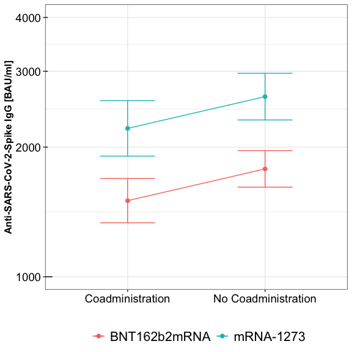<!-- -->

``` r
ggsave(plot = int_plt_mm, filename = file.path(plot.dir,"png/Interaction_marginal_means_1.png"), device = "png", width = 6, height = 6, dpi = 300)
ggsave(plot = int_plt_mm, filename = file.path(plot.dir,"svg/Interaction_marginal_means_1.svg"), device = "svg", width = 6, height = 6, dpi = 300)
```

## Check assumptions for multiple regression analysis

### Test for Autocorrelation (Durbin-Watson)

``` r
model_residuals <- as.numeric(residuals(gls_mod))
dw_stat <- car::durbinWatsonTest(model_residuals)

# Calculate P-value based on permutation
n_obs <- length(model_residuals)
n_samplings <- 1000
mu <- fitted.values(gls_mod)
X_model <- model.matrix(logIgG ~  AgeCategory + gender +  smoking + coadmin  + vaccine + time_serum_coadmin + risk + sideeffects, 
                        data = df_test)

sampled_data <-  matrix(sample(model_residuals, n_obs * n_samplings, replace = TRUE), n_obs, n_samplings) + matrix(mu, n_obs, n_samplings)

E <- residuals(nlme::gls(sampled_data ~ X_model - 1, weights = nlme::varPower()))
dw_sampled <- apply(E, 2, car::durbinWatsonTest)

p_value_dw <- (sum(dw_sampled > dw_stat))/n_samplings
p_value_dw <- 2 * (min(p_value_dw, 1 - p_value_dw))

hist(dw_sampled, breaks = 50, freq = T, main = "Histogram sampled DW statistics", xlab = "Sampled DW values", col = "white")
abline(v = dw_stat, lwd = 3, col = "red")
```

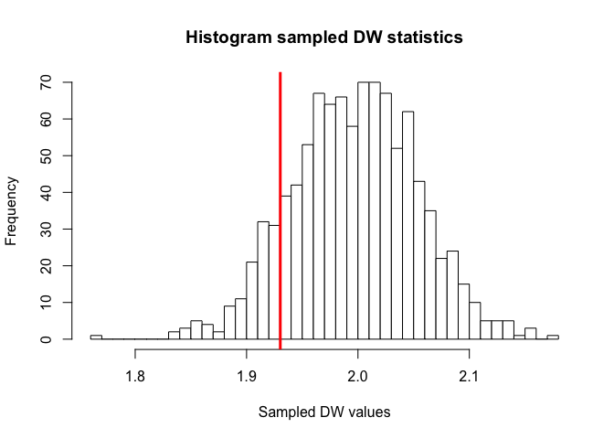<!-- -->

**Durbin-Watson-Test for autocorrelation (no autocorrelation):**

**Test statistic: *d =* 1.93**

**P-value: *p =* 0.24**

### Normality of residuals

``` r
x_vals <- seq(min(model_residuals), max(model_residuals), length.out = 1000)

hist(model_residuals, xlab = "Residuals", prob = T, col = "white", main = expression('Density of residuals'), breaks = 30)
lines(x = x_vals, y = dnorm(x = x_vals, mean = mean(model_residuals), sd = sd(model_residuals)), lty = 1, lwd = 2)
```

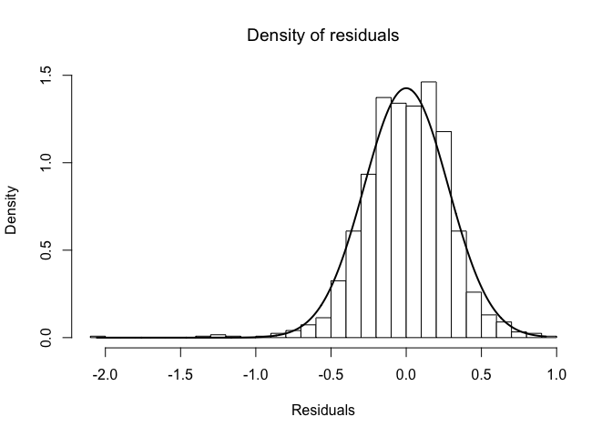<!-- -->

``` r
png(filename = file.path(plot.dir, "png/histogram_residuals.png"), units="px", width=1600, height=1600, res=300)
hist(model_residuals, xlab = "Residuals", prob = T, col = "white", main = expression('Density of residuals'), breaks = 30)
lines(x = x_vals, y = dnorm(x = x_vals, mean = mean(model_residuals), sd = sd(model_residuals)), lty = 1, lwd = 2)
dev.off()

svg(filename = file.path(plot.dir, "svg/histogram_residuals.svg"), width=6, height=6)
hist(model_residuals, xlab = "Residuals", prob = T, col = "white", main = expression('Density of residuals'), breaks = 30)
lines(x = x_vals, y = dnorm(x = x_vals, mean = mean(model_residuals), sd = sd(model_residuals)), lty = 1, lwd = 2)
dev.off()
```

### Variance of residuals

``` r
data.frame(fit = mu, residuals = model_residuals) %>% 
  ggplot2::ggplot(aes(x = fit, y = residuals)) + 
  ggplot2::geom_point(alpha = 0.75, pch = 20, size = 2) + 
  ggplot2::xlab("Fitted values based on linear model") + 
  ggplot2::ylab("Residuals from linear model") + 
  ggplot2::theme_bw() +
  ggplot2::theme(axis.text = ggplot2::element_text(size = 14, colour = "black"),
                 axis.title = ggplot2::element_text(face = "bold", size = 12),
                 legend.title = ggplot2::element_blank(),
                 legend.text = ggplot2::element_text(size = 16),
                 legend.position = "bottom")
```

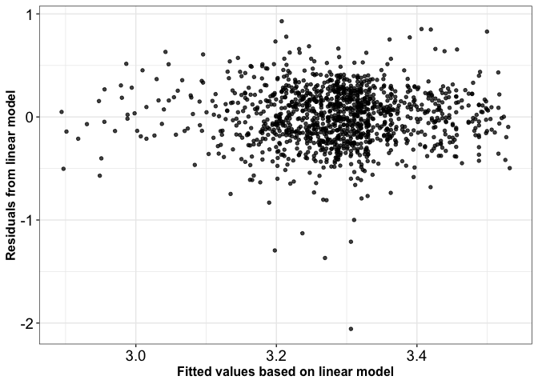<!-- -->

``` r
ggplot2::ggsave(plot = last_plot(), filename = file.path(plot.dir, "png", "Regression_model_residual_variances.png"), device = "png",  width = 10, height = 8, dpi = 300)
ggplot2::ggsave(plot = last_plot(), filename = file.path(plot.dir, "svg", "Regression_model_residual_variances.svg"), device = "svg",  width = 10, height = 8, dpi = 300)
```

## Coefficients of the multiple regression model

``` r
sum_gls <- summary(gls_mod)
glm_p_values <- cbind(sum_gls$tTable, p.adj = p.adjust(sum_gls$tTable[,4], method = "BY"))

anova_gls <- as.data.frame(anova(gls_mod))
anova_gls <- cbind(anova_gls, p.adj = p.adjust(anova_gls$`p-value`, method = "BY"))
anova_gls <- anova_gls %>% mutate(p_plot = dplyr::case_when(p.adj < 1e-4 ~ "< 0.0001",
                                             p.adj > 1e-4 &  p.adj < 1e-3  ~"< 0.001",
                                             p.adj > 1e-3 &  p.adj < 1e-2  ~ "< 0.01",
                                             p.adj > 1e-2 &  p.adj < 0.05  ~ "< 0.05",
                                             TRUE ~ format(round(p.adj, 2))
                                             ))

y_hat_igg <- predict(gls_mod, interval = "prediction") 
rsquare_cv <- cor(df_test$logIgG, y_hat_igg)^2

anova_gls %>% knitr::kable() %>%
  kableExtra::kable_paper()
```

## Posthoc tests: Pairwise comparisons within discrete factors

-   compare subgroups within discrete factors
-   estimate marginal means for each factor and compare the subgroups

``` r
entities <- c("AgeCategory", "gender", "coadmin", "vaccine", "smoking", "sideeffects", "risk", "vaccine + coadmin")
marg_list <- list()
for(i in seq_along(entities)){
  marginal <- emmeans(gls_mod, eval(parse( text = paste0("~ ", entities[i]))), rg.limit = 160000, weights = "proportional")
  marg_list[[i]] <- as.data.frame(pairs(marginal))
}

names(marg_list) <- entities

post_hoc_comp <- do.call("rbind", marg_list)

post_hoc_comp$contrast <- gsub(pattern = "\\(|\\)", replacement = "", x = post_hoc_comp$contrast)
post_hoc_comp <- cbind(post_hoc_comp, p.adj = p.adjust(post_hoc_comp$p.value, method = "BY"))

risk_labels <- paste0("Be at Risk: ", apply(combn(x = c("False", "Rather not true ", "Partly", "Rather true", "True"), m = 2),  2, function(col_el){
  paste0(col_el, collapse = " vs. ")
}))

coadmin_labels <- paste0(apply(combn(x = c("BNT162b2mRNA:Coadministration", "mRNA-1273:Coadministration", "BNT162b2mRNA:No Coadministration", "mRNA-1273:No Coadministration"), m = 2),  2, function(col_el){
  paste0(col_el, collapse = " vs. ")
}))

contrast_labels <- c("Age (18-40 vs. ≥41)", "Gender (female vs. male)", "Coadministration (yes vs. no)", "Vaccine (BNT162b2mRNA vs. mRNA-1273)", "Smoking (yes vs. no)", "Side effects (yes vs. no)", risk_labels, coadmin_labels)
post_hoc_comp <- cbind(comparison = contrast_labels, post_hoc_comp)

post_hoc_comp %>% select(-contrast) %>% knitr::kable(row.names = F) %>%
  kableExtra::kable_paper() %>%
  kableExtra::scroll_box(width = "1000px")
```

<div
style="border: 1px solid #ddd; padding: 5px; overflow-x: scroll; width:1000px; ">

<table class=" lightable-paper" style="font-family: &quot;Arial Narrow&quot;, arial, helvetica, sans-serif; margin-left: auto; margin-right: auto;">
<thead>
<tr>
<th style="text-align:left;">
comparison
</th>
<th style="text-align:right;">
estimate
</th>
<th style="text-align:right;">
SE
</th>
<th style="text-align:right;">
df
</th>
<th style="text-align:right;">
t.ratio
</th>
<th style="text-align:right;">
p.value
</th>
<th style="text-align:right;">
p.adj
</th>
</tr>
</thead>
<tbody>
<tr>
<td style="text-align:left;">
Age (18-40 vs. ≥41)
</td>
<td style="text-align:right;">
0.0323765
</td>
<td style="text-align:right;">
0.0165665
</td>
<td style="text-align:right;">
1207.2790
</td>
<td style="text-align:right;">
1.9543419
</td>
<td style="text-align:right;">
0.0508914
</td>
<td style="text-align:right;">
0.4132273
</td>
</tr>
<tr>
<td style="text-align:left;">
Gender (female vs. male)
</td>
<td style="text-align:right;">
0.0094272
</td>
<td style="text-align:right;">
0.0214004
</td>
<td style="text-align:right;">
1195.7206
</td>
<td style="text-align:right;">
0.4405171
</td>
<td style="text-align:right;">
0.6596423
</td>
<td style="text-align:right;">
1.0000000
</td>
</tr>
<tr>
<td style="text-align:left;">
Coadministration (yes vs. no)
</td>
<td style="text-align:right;">
-0.0736915
</td>
<td style="text-align:right;">
0.0207893
</td>
<td style="text-align:right;">
937.9455
</td>
<td style="text-align:right;">
-3.5446789
</td>
<td style="text-align:right;">
0.0004125
</td>
<td style="text-align:right;">
0.0066989
</td>
</tr>
<tr>
<td style="text-align:left;">
Vaccine (BNT162b2mRNA vs. mRNA-1273)
</td>
<td style="text-align:right;">
-0.1677947
</td>
<td style="text-align:right;">
0.0202995
</td>
<td style="text-align:right;">
669.0950
</td>
<td style="text-align:right;">
-8.2659418
</td>
<td style="text-align:right;">
0.0000000
</td>
<td style="text-align:right;">
0.0000000
</td>
</tr>
<tr>
<td style="text-align:left;">
Smoking (yes vs. no)
</td>
<td style="text-align:right;">
0.0422851
</td>
<td style="text-align:right;">
0.0242530
</td>
<td style="text-align:right;">
1090.4744
</td>
<td style="text-align:right;">
1.7434988
</td>
<td style="text-align:right;">
0.0815283
</td>
<td style="text-align:right;">
0.6018118
</td>
</tr>
<tr>
<td style="text-align:left;">
Side effects (yes vs. no)
</td>
<td style="text-align:right;">
0.0767238
</td>
<td style="text-align:right;">
0.0240995
</td>
<td style="text-align:right;">
865.4202
</td>
<td style="text-align:right;">
3.1836221
</td>
<td style="text-align:right;">
0.0015064
</td>
<td style="text-align:right;">
0.0203864
</td>
</tr>
<tr>
<td style="text-align:left;">
Be at Risk: False vs. Rather not true
</td>
<td style="text-align:right;">
-0.0425071
</td>
<td style="text-align:right;">
0.0196855
</td>
<td style="text-align:right;">
1192.5004
</td>
<td style="text-align:right;">
-2.1593099
</td>
<td style="text-align:right;">
0.1960676
</td>
<td style="text-align:right;">
1.0000000
</td>
</tr>
<tr>
<td style="text-align:left;">
Be at Risk: False vs. Partly
</td>
<td style="text-align:right;">
-0.0487488
</td>
<td style="text-align:right;">
0.0269748
</td>
<td style="text-align:right;">
1012.0775
</td>
<td style="text-align:right;">
-1.8071981
</td>
<td style="text-align:right;">
0.3698818
</td>
<td style="text-align:right;">
1.0000000
</td>
</tr>
<tr>
<td style="text-align:left;">
Be at Risk: False vs. Rather true
</td>
<td style="text-align:right;">
-0.0082020
</td>
<td style="text-align:right;">
0.0404317
</td>
<td style="text-align:right;">
1139.7984
</td>
<td style="text-align:right;">
-0.2028609
</td>
<td style="text-align:right;">
0.9996230
</td>
<td style="text-align:right;">
1.0000000
</td>
</tr>
<tr>
<td style="text-align:left;">
Be at Risk: False vs. True
</td>
<td style="text-align:right;">
0.0561754
</td>
<td style="text-align:right;">
0.0621585
</td>
<td style="text-align:right;">
730.0658
</td>
<td style="text-align:right;">
0.9037446
</td>
<td style="text-align:right;">
0.8954753
</td>
<td style="text-align:right;">
1.0000000
</td>
</tr>
<tr>
<td style="text-align:left;">
Be at Risk: Rather not true vs. Partly
</td>
<td style="text-align:right;">
-0.0062417
</td>
<td style="text-align:right;">
0.0296233
</td>
<td style="text-align:right;">
1037.7959
</td>
<td style="text-align:right;">
-0.2107028
</td>
<td style="text-align:right;">
0.9995618
</td>
<td style="text-align:right;">
1.0000000
</td>
</tr>
<tr>
<td style="text-align:left;">
Be at Risk: Rather not true vs. Rather true
</td>
<td style="text-align:right;">
0.0343051
</td>
<td style="text-align:right;">
0.0422529
</td>
<td style="text-align:right;">
1140.2403
</td>
<td style="text-align:right;">
0.8118992
</td>
<td style="text-align:right;">
0.9270240
</td>
<td style="text-align:right;">
1.0000000
</td>
</tr>
<tr>
<td style="text-align:left;">
Be at Risk: Rather not true vs. True
</td>
<td style="text-align:right;">
0.0986825
</td>
<td style="text-align:right;">
0.0632135
</td>
<td style="text-align:right;">
758.7685
</td>
<td style="text-align:right;">
1.5610994
</td>
<td style="text-align:right;">
0.5229647
</td>
<td style="text-align:right;">
1.0000000
</td>
</tr>
<tr>
<td style="text-align:left;">
Be at Risk: Partly vs. Rather true
</td>
<td style="text-align:right;">
0.0405468
</td>
<td style="text-align:right;">
0.0460440
</td>
<td style="text-align:right;">
1088.1065
</td>
<td style="text-align:right;">
0.8806106
</td>
<td style="text-align:right;">
0.9040751
</td>
<td style="text-align:right;">
1.0000000
</td>
</tr>
<tr>
<td style="text-align:left;">
Be at Risk: Partly vs. True
</td>
<td style="text-align:right;">
0.1049242
</td>
<td style="text-align:right;">
0.0658868
</td>
<td style="text-align:right;">
853.2955
</td>
<td style="text-align:right;">
1.5924930
</td>
<td style="text-align:right;">
0.5025926
</td>
<td style="text-align:right;">
1.0000000
</td>
</tr>
<tr>
<td style="text-align:left;">
Be at Risk: Rather true vs. True
</td>
<td style="text-align:right;">
0.0643774
</td>
<td style="text-align:right;">
0.0724842
</td>
<td style="text-align:right;">
958.4117
</td>
<td style="text-align:right;">
0.8881581
</td>
<td style="text-align:right;">
0.9013176
</td>
<td style="text-align:right;">
1.0000000
</td>
</tr>
<tr>
<td style="text-align:left;">
BNT162b2mRNA:Coadministration vs. mRNA-1273:Coadministration
</td>
<td style="text-align:right;">
-0.1677947
</td>
<td style="text-align:right;">
0.0202995
</td>
<td style="text-align:right;">
669.0950
</td>
<td style="text-align:right;">
-8.2659418
</td>
<td style="text-align:right;">
0.0000000
</td>
<td style="text-align:right;">
0.0000000
</td>
</tr>
<tr>
<td style="text-align:left;">
BNT162b2mRNA:Coadministration vs. BNT162b2mRNA:No Coadministration
</td>
<td style="text-align:right;">
-0.0736915
</td>
<td style="text-align:right;">
0.0207893
</td>
<td style="text-align:right;">
937.9455
</td>
<td style="text-align:right;">
-3.5446789
</td>
<td style="text-align:right;">
0.0023279
</td>
<td style="text-align:right;">
0.0236272
</td>
</tr>
<tr>
<td style="text-align:left;">
BNT162b2mRNA:Coadministration vs. mRNA-1273:No Coadministration
</td>
<td style="text-align:right;">
-0.2414862
</td>
<td style="text-align:right;">
0.0273508
</td>
<td style="text-align:right;">
1188.3990
</td>
<td style="text-align:right;">
-8.8292082
</td>
<td style="text-align:right;">
0.0000000
</td>
<td style="text-align:right;">
0.0000000
</td>
</tr>
<tr>
<td style="text-align:left;">
mRNA-1273:Coadministration vs. BNT162b2mRNA:No Coadministration
</td>
<td style="text-align:right;">
0.0941032
</td>
<td style="text-align:right;">
0.0306670
</td>
<td style="text-align:right;">
1187.2269
</td>
<td style="text-align:right;">
3.0685480
</td>
<td style="text-align:right;">
0.0117896
</td>
<td style="text-align:right;">
0.1063656
</td>
</tr>
<tr>
<td style="text-align:left;">
mRNA-1273:Coadministration vs. mRNA-1273:No Coadministration
</td>
<td style="text-align:right;">
-0.0736915
</td>
<td style="text-align:right;">
0.0207893
</td>
<td style="text-align:right;">
937.9455
</td>
<td style="text-align:right;">
-3.5446789
</td>
<td style="text-align:right;">
0.0023279
</td>
<td style="text-align:right;">
0.0236272
</td>
</tr>
<tr>
<td style="text-align:left;">
BNT162b2mRNA:No Coadministration vs. mRNA-1273:No Coadministration
</td>
<td style="text-align:right;">
-0.1677947
</td>
<td style="text-align:right;">
0.0202995
</td>
<td style="text-align:right;">
669.0950
</td>
<td style="text-align:right;">
-8.2659418
</td>
<td style="text-align:right;">
0.0000000
</td>
<td style="text-align:right;">
0.0000000
</td>
</tr>
</tbody>
</table>

</div>

## Table IgG concentrations and statistical significance

``` r
var_factors <- list("AgeCategory", "gender", "coadmin", "vaccine", "smoking", "risk", "sideeffects", c("vaccine","coadmin"))

gr_stat <- do.call("rbind", lapply(var_factors, function(var_fac){
  
  df_sum <- c()
  if(length(var_fac) == 1){

    df_sum <- df_test %>% group_by(!!sym(var_fac)) %>% summarise(value = med_iqr(IgG),
                                                                 Min = min(IgG),
                                                                 Max = max(IgG),
                                                                 N = n()) %>% 
                          rename(gr = !!sym(var_fac))
    
  }else{
    
    df_sum <- df_test %>% group_by(vaccine, coadmin) %>% summarise(value = med_iqr(IgG),
                                                                   Min = min(IgG),
                                                                   Max = max(IgG),
                                                                   N = n()) %>% 
                          mutate(gr = paste0(vaccine, " ", coadmin)) %>% ungroup() %>% dplyr::select(gr, value, Min, Max, N)
  }
  
  df_sum
}))

 
gr_mat <- do.call("rbind", strsplit(x = as.character(post_hoc_comp$contrast), split =  " - "))
colnames(gr_mat) <- c("gr1", "gr2")

df_table_igg <- cbind(post_hoc_comp, gr_mat) %>% dplyr::inner_join(gr_stat, by = c("gr1" = "gr")) %>% dplyr::inner_join(gr_stat, by = c("gr2" = "gr")) %>% 
                mutate(p.short = dplyr::case_when(p.value >= 0.01 ~ as.character(round(p.value, 2)),
                                                  p.value < 0.0001 ~ "< 0.0001",
                                                  p.value < 0.001 ~ "< 0.001",
                                                  p.value < 0.01 ~ "< 0.01"),
                       p.ad.short = dplyr::case_when(p.adj >= 0.01 ~ as.character(round(p.adj, 2)),
                                                  p.adj < 0.0001 ~ "< 0.0001",
                                                  p.adj < 0.001 ~ "< 0.001",
                                                  p.adj < 0.01 ~ "< 0.01"),
                       across(.cols = where(is.numeric), .fns = function(x) format(round(x, digits = 2), 
                                                                                    digits = 2, nsmall = 2, 
                                                                                    format = "f", scientific = F)),
                       gr1 = if_else(grepl(x = comparison, pattern = "Side"), true = "side effects", false = gr1),
                       gr2 = if_else(grepl(x = comparison, pattern = "Side"), true = "no side effects", false = gr2))

df_table_igg <- df_table_igg %>% rename(p.adjusted = p.adj,
                                        "Median(Gr1) ± IQR" = value.x,
                                        "Median(Gr2) ± IQR" = value.y,
                                        "Min(Gr1)" = Min.x,
                                        "Min(Gr2)" = Min.y,
                                        "Max(Gr1)" = Max.x,
                                        "Max(Gr2)" = Max.y,
                                        "N(Gr1)" = N.x,
                                        "N(Gr2)" = N.y,
                                        "Group 1" = gr1,
                                        "Group 2" = gr2) %>% 
                relocate("Group 1", "Group 2", "N(Gr1)", "Min(Gr1)", "Max(Gr1)", "Median(Gr1) ± IQR", "N(Gr2)", "Min(Gr2)", "Max(Gr2)", "Median(Gr2) ± IQR", p.value, p.adjusted, p.short, p.ad.short) %>% 
                dplyr::select(-comparison, -contrast, -estimate, -SE, -df, -t.ratio)

df_table_igg %>% knitr::kable() %>%
  kableExtra::kable_paper() %>% 
  kableExtra::pack_rows("Be at risk: ", 7, 16) %>%
  kableExtra::pack_rows("Vaccine third doses and Coadministration: ", 17, 22) %>%
  kableExtra::add_header_above(c(" " = 2, "Group 1 (IgG statistics)" = 4, "Group 2 (IgG statistics)" = 4, "Group 1 vs. Group 2" = 4)) %>%
  kableExtra::scroll_box(width = "1400px")
```

<div
style="border: 1px solid #ddd; padding: 5px; overflow-x: scroll; width:1400px; ">

<table class=" lightable-paper" style="font-family: &quot;Arial Narrow&quot;, arial, helvetica, sans-serif; margin-left: auto; margin-right: auto;">
<thead>
<tr>
<th style="empty-cells: hide;" colspan="2">
</th>
<th style="padding-bottom:0; padding-left:3px;padding-right:3px;text-align: center; " colspan="4">

<div style="border-bottom: 1px solid #00000020; padding-bottom: 5px; ">

Group 1 (IgG statistics)

</div>

</th>
<th style="padding-bottom:0; padding-left:3px;padding-right:3px;text-align: center; " colspan="4">

<div style="border-bottom: 1px solid #00000020; padding-bottom: 5px; ">

Group 2 (IgG statistics)

</div>

</th>
<th style="padding-bottom:0; padding-left:3px;padding-right:3px;text-align: center; " colspan="4">

<div style="border-bottom: 1px solid #00000020; padding-bottom: 5px; ">

Group 1 vs. Group 2

</div>

</th>
</tr>
<tr>
<th style="text-align:left;">
Group 1
</th>
<th style="text-align:left;">
Group 2
</th>
<th style="text-align:left;">
N(Gr1)
</th>
<th style="text-align:left;">
Min(Gr1)
</th>
<th style="text-align:left;">
Max(Gr1)
</th>
<th style="text-align:left;">
Median(Gr1) ± IQR
</th>
<th style="text-align:left;">
N(Gr2)
</th>
<th style="text-align:left;">
Min(Gr2)
</th>
<th style="text-align:left;">
Max(Gr2)
</th>
<th style="text-align:left;">
Median(Gr2) ± IQR
</th>
<th style="text-align:left;">
p.value
</th>
<th style="text-align:left;">
p.adjusted
</th>
<th style="text-align:left;">
p.short
</th>
<th style="text-align:left;">
p.ad.short
</th>
</tr>
</thead>
<tbody>
<tr>
<td style="text-align:left;">
18-40
</td>
<td style="text-align:left;">
40+
</td>
<td style="text-align:left;">
604.00
</td>
<td style="text-align:left;">
17.76
</td>
<td style="text-align:left;">
12985.14
</td>
<td style="text-align:left;">
2052.6 (1321.9-2979.5)
</td>
<td style="text-align:left;">
627.00
</td>
<td style="text-align:left;">
79.90
</td>
<td style="text-align:left;">
21287.91
</td>
<td style="text-align:left;">
1976.4 (1221.5-3172.6)
</td>
<td style="text-align:left;">
0.05
</td>
<td style="text-align:left;">
0.41
</td>
<td style="text-align:left;">
0.05
</td>
<td style="text-align:left;">
0.41
</td>
</tr>
<tr>
<td style="text-align:left;">
female
</td>
<td style="text-align:left;">
male
</td>
<td style="text-align:left;">
1015.00
</td>
<td style="text-align:left;">
79.54
</td>
<td style="text-align:left;">
21287.91
</td>
<td style="text-align:left;">
2024.4 (1287.3-3082.1)
</td>
<td style="text-align:left;">
216.00
</td>
<td style="text-align:left;">
17.76
</td>
<td style="text-align:left;">
13697.46
</td>
<td style="text-align:left;">
1980.8 (1157.2-3029.7)
</td>
<td style="text-align:left;">
0.66
</td>
<td style="text-align:left;">
1.00
</td>
<td style="text-align:left;">
0.66
</td>
<td style="text-align:left;">
1
</td>
</tr>
<tr>
<td style="text-align:left;">
Coadministration
</td>
<td style="text-align:left;">
No Coadministration
</td>
<td style="text-align:left;">
249.00
</td>
<td style="text-align:left;">
239.06
</td>
<td style="text-align:left;">
18541.53
</td>
<td style="text-align:left;">
1605 (1078-2504.7)
</td>
<td style="text-align:left;">
982.00
</td>
<td style="text-align:left;">
17.76
</td>
<td style="text-align:left;">
21287.91
</td>
<td style="text-align:left;">
2150.2 (1341.1-3242.3)
</td>
<td style="text-align:left;">
0.00
</td>
<td style="text-align:left;">
0.01
</td>
<td style="text-align:left;">
\< 0.001
</td>
<td style="text-align:left;">
\< 0.01
</td>
</tr>
<tr>
<td style="text-align:left;">
BNT162b2mRNA
</td>
<td style="text-align:left;">
mRNA-1273
</td>
<td style="text-align:left;">
996.00
</td>
<td style="text-align:left;">
17.76
</td>
<td style="text-align:left;">
13697.46
</td>
<td style="text-align:left;">
1888.4 (1192.6-2916.8)
</td>
<td style="text-align:left;">
235.00
</td>
<td style="text-align:left;">
365.36
</td>
<td style="text-align:left;">
21287.91
</td>
<td style="text-align:left;">
2655.8 (1698.7-3987.9)
</td>
<td style="text-align:left;">
0.00
</td>
<td style="text-align:left;">
0.00
</td>
<td style="text-align:left;">
\< 0.0001
</td>
<td style="text-align:left;">
\< 0.0001
</td>
</tr>
<tr>
<td style="text-align:left;">
smoker
</td>
<td style="text-align:left;">
non-smoker
</td>
<td style="text-align:left;">
150.00
</td>
<td style="text-align:left;">
204.73
</td>
<td style="text-align:left;">
12985.14
</td>
<td style="text-align:left;">
2134 (1437.2-3264.5)
</td>
<td style="text-align:left;">
1081.00
</td>
<td style="text-align:left;">
17.76
</td>
<td style="text-align:left;">
21287.91
</td>
<td style="text-align:left;">
1997.1 (1237.3-3051.2)
</td>
<td style="text-align:left;">
0.08
</td>
<td style="text-align:left;">
0.60
</td>
<td style="text-align:left;">
0.08
</td>
<td style="text-align:left;">
0.6
</td>
</tr>
<tr>
<td style="text-align:left;">
side effects
</td>
<td style="text-align:left;">
no side effects
</td>
<td style="text-align:left;">
1059.00
</td>
<td style="text-align:left;">
17.76
</td>
<td style="text-align:left;">
21287.91
</td>
<td style="text-align:left;">
2103.8 (1310.8-3184.6)
</td>
<td style="text-align:left;">
172.00
</td>
<td style="text-align:left;">
228.19
</td>
<td style="text-align:left;">
11950.47
</td>
<td style="text-align:left;">
1702.7 (1027.9-2534.7)
</td>
<td style="text-align:left;">
0.00
</td>
<td style="text-align:left;">
0.02
</td>
<td style="text-align:left;">
\< 0.01
</td>
<td style="text-align:left;">
0.02
</td>
</tr>
<tr grouplength="10">
<td colspan="14" style="border-bottom: 1px solid #00000020;">
<strong>Be at risk: </strong>
</td>
</tr>
<tr>
<td style="text-align:left;padding-left: 2em;" indentlevel="1">
false
</td>
<td style="text-align:left;">
rather false
</td>
<td style="text-align:left;">
737.00
</td>
<td style="text-align:left;">
17.76
</td>
<td style="text-align:left;">
18189.57
</td>
<td style="text-align:left;">
1955.1 (1270.5-2935.4)
</td>
<td style="text-align:left;">
296.00
</td>
<td style="text-align:left;">
79.54
</td>
<td style="text-align:left;">
18541.53
</td>
<td style="text-align:left;">
2037.6 (1232.6-3238.8)
</td>
<td style="text-align:left;">
0.20
</td>
<td style="text-align:left;">
1.00
</td>
<td style="text-align:left;">
0.2
</td>
<td style="text-align:left;">
1
</td>
</tr>
<tr>
<td style="text-align:left;padding-left: 2em;" indentlevel="1">
false
</td>
<td style="text-align:left;">
partly
</td>
<td style="text-align:left;">
737.00
</td>
<td style="text-align:left;">
17.76
</td>
<td style="text-align:left;">
18189.57
</td>
<td style="text-align:left;">
1955.1 (1270.5-2935.4)
</td>
<td style="text-align:left;">
124.00
</td>
<td style="text-align:left;">
244.08
</td>
<td style="text-align:left;">
21287.91
</td>
<td style="text-align:left;">
2258 (1339.7-3343.7)
</td>
<td style="text-align:left;">
0.37
</td>
<td style="text-align:left;">
1.00
</td>
<td style="text-align:left;">
0.37
</td>
<td style="text-align:left;">
1
</td>
</tr>
<tr>
<td style="text-align:left;padding-left: 2em;" indentlevel="1">
false
</td>
<td style="text-align:left;">
rather true
</td>
<td style="text-align:left;">
737.00
</td>
<td style="text-align:left;">
17.76
</td>
<td style="text-align:left;">
18189.57
</td>
<td style="text-align:left;">
1955.1 (1270.5-2935.4)
</td>
<td style="text-align:left;">
51.00
</td>
<td style="text-align:left;">
128.32
</td>
<td style="text-align:left;">
12985.14
</td>
<td style="text-align:left;">
2396.9 (1377-3341.1)
</td>
<td style="text-align:left;">
1.00
</td>
<td style="text-align:left;">
1.00
</td>
<td style="text-align:left;">
1
</td>
<td style="text-align:left;">
1
</td>
</tr>
<tr>
<td style="text-align:left;padding-left: 2em;" indentlevel="1">
false
</td>
<td style="text-align:left;">
true
</td>
<td style="text-align:left;">
737.00
</td>
<td style="text-align:left;">
17.76
</td>
<td style="text-align:left;">
18189.57
</td>
<td style="text-align:left;">
1955.1 (1270.5-2935.4)
</td>
<td style="text-align:left;">
23.00
</td>
<td style="text-align:left;">
79.90
</td>
<td style="text-align:left;">
6521.13
</td>
<td style="text-align:left;">
1493.7 (936.2-4202.1)
</td>
<td style="text-align:left;">
0.90
</td>
<td style="text-align:left;">
1.00
</td>
<td style="text-align:left;">
0.9
</td>
<td style="text-align:left;">
1
</td>
</tr>
<tr>
<td style="text-align:left;padding-left: 2em;" indentlevel="1">
rather false
</td>
<td style="text-align:left;">
partly
</td>
<td style="text-align:left;">
296.00
</td>
<td style="text-align:left;">
79.54
</td>
<td style="text-align:left;">
18541.53
</td>
<td style="text-align:left;">
2037.6 (1232.6-3238.8)
</td>
<td style="text-align:left;">
124.00
</td>
<td style="text-align:left;">
244.08
</td>
<td style="text-align:left;">
21287.91
</td>
<td style="text-align:left;">
2258 (1339.7-3343.7)
</td>
<td style="text-align:left;">
1.00
</td>
<td style="text-align:left;">
1.00
</td>
<td style="text-align:left;">
1
</td>
<td style="text-align:left;">
1
</td>
</tr>
<tr>
<td style="text-align:left;padding-left: 2em;" indentlevel="1">
rather false
</td>
<td style="text-align:left;">
rather true
</td>
<td style="text-align:left;">
296.00
</td>
<td style="text-align:left;">
79.54
</td>
<td style="text-align:left;">
18541.53
</td>
<td style="text-align:left;">
2037.6 (1232.6-3238.8)
</td>
<td style="text-align:left;">
51.00
</td>
<td style="text-align:left;">
128.32
</td>
<td style="text-align:left;">
12985.14
</td>
<td style="text-align:left;">
2396.9 (1377-3341.1)
</td>
<td style="text-align:left;">
0.93
</td>
<td style="text-align:left;">
1.00
</td>
<td style="text-align:left;">
0.93
</td>
<td style="text-align:left;">
1
</td>
</tr>
<tr>
<td style="text-align:left;padding-left: 2em;" indentlevel="1">
rather false
</td>
<td style="text-align:left;">
true
</td>
<td style="text-align:left;">
296.00
</td>
<td style="text-align:left;">
79.54
</td>
<td style="text-align:left;">
18541.53
</td>
<td style="text-align:left;">
2037.6 (1232.6-3238.8)
</td>
<td style="text-align:left;">
23.00
</td>
<td style="text-align:left;">
79.90
</td>
<td style="text-align:left;">
6521.13
</td>
<td style="text-align:left;">
1493.7 (936.2-4202.1)
</td>
<td style="text-align:left;">
0.52
</td>
<td style="text-align:left;">
1.00
</td>
<td style="text-align:left;">
0.52
</td>
<td style="text-align:left;">
1
</td>
</tr>
<tr>
<td style="text-align:left;padding-left: 2em;" indentlevel="1">
partly
</td>
<td style="text-align:left;">
rather true
</td>
<td style="text-align:left;">
124.00
</td>
<td style="text-align:left;">
244.08
</td>
<td style="text-align:left;">
21287.91
</td>
<td style="text-align:left;">
2258 (1339.7-3343.7)
</td>
<td style="text-align:left;">
51.00
</td>
<td style="text-align:left;">
128.32
</td>
<td style="text-align:left;">
12985.14
</td>
<td style="text-align:left;">
2396.9 (1377-3341.1)
</td>
<td style="text-align:left;">
0.90
</td>
<td style="text-align:left;">
1.00
</td>
<td style="text-align:left;">
0.9
</td>
<td style="text-align:left;">
1
</td>
</tr>
<tr>
<td style="text-align:left;padding-left: 2em;" indentlevel="1">
partly
</td>
<td style="text-align:left;">
true
</td>
<td style="text-align:left;">
124.00
</td>
<td style="text-align:left;">
244.08
</td>
<td style="text-align:left;">
21287.91
</td>
<td style="text-align:left;">
2258 (1339.7-3343.7)
</td>
<td style="text-align:left;">
23.00
</td>
<td style="text-align:left;">
79.90
</td>
<td style="text-align:left;">
6521.13
</td>
<td style="text-align:left;">
1493.7 (936.2-4202.1)
</td>
<td style="text-align:left;">
0.50
</td>
<td style="text-align:left;">
1.00
</td>
<td style="text-align:left;">
0.5
</td>
<td style="text-align:left;">
1
</td>
</tr>
<tr>
<td style="text-align:left;padding-left: 2em;" indentlevel="1">
rather true
</td>
<td style="text-align:left;">
true
</td>
<td style="text-align:left;">
51.00
</td>
<td style="text-align:left;">
128.32
</td>
<td style="text-align:left;">
12985.14
</td>
<td style="text-align:left;">
2396.9 (1377-3341.1)
</td>
<td style="text-align:left;">
23.00
</td>
<td style="text-align:left;">
79.90
</td>
<td style="text-align:left;">
6521.13
</td>
<td style="text-align:left;">
1493.7 (936.2-4202.1)
</td>
<td style="text-align:left;">
0.90
</td>
<td style="text-align:left;">
1.00
</td>
<td style="text-align:left;">
0.9
</td>
<td style="text-align:left;">
1
</td>
</tr>
<tr grouplength="6">
<td colspan="14" style="border-bottom: 1px solid #00000020;">
<strong>Vaccine third doses and Coadministration: </strong>
</td>
</tr>
<tr>
<td style="text-align:left;padding-left: 2em;" indentlevel="1">
BNT162b2mRNA Coadministration
</td>
<td style="text-align:left;">
mRNA-1273 Coadministration
</td>
<td style="text-align:left;">
225.00
</td>
<td style="text-align:left;">
239.06
</td>
<td style="text-align:left;">
8923.95
</td>
<td style="text-align:left;">
1560.7 (1078-2493.6)
</td>
<td style="text-align:left;">
24.00
</td>
<td style="text-align:left;">
547.41
</td>
<td style="text-align:left;">
18541.53
</td>
<td style="text-align:left;">
1891.1 (1068.2-3324)
</td>
<td style="text-align:left;">
0.00
</td>
<td style="text-align:left;">
0.00
</td>
<td style="text-align:left;">
\< 0.0001
</td>
<td style="text-align:left;">
\< 0.0001
</td>
</tr>
<tr>
<td style="text-align:left;padding-left: 2em;" indentlevel="1">
BNT162b2mRNA Coadministration
</td>
<td style="text-align:left;">
BNT162b2mRNA No Coadministration
</td>
<td style="text-align:left;">
225.00
</td>
<td style="text-align:left;">
239.06
</td>
<td style="text-align:left;">
8923.95
</td>
<td style="text-align:left;">
1560.7 (1078-2493.6)
</td>
<td style="text-align:left;">
771.00
</td>
<td style="text-align:left;">
17.76
</td>
<td style="text-align:left;">
13697.46
</td>
<td style="text-align:left;">
1955.1 (1234.6-3022.9)
</td>
<td style="text-align:left;">
0.00
</td>
<td style="text-align:left;">
0.02
</td>
<td style="text-align:left;">
\< 0.01
</td>
<td style="text-align:left;">
0.02
</td>
</tr>
<tr>
<td style="text-align:left;padding-left: 2em;" indentlevel="1">
BNT162b2mRNA Coadministration
</td>
<td style="text-align:left;">
mRNA-1273 No Coadministration
</td>
<td style="text-align:left;">
225.00
</td>
<td style="text-align:left;">
239.06
</td>
<td style="text-align:left;">
8923.95
</td>
<td style="text-align:left;">
1560.7 (1078-2493.6)
</td>
<td style="text-align:left;">
211.00
</td>
<td style="text-align:left;">
365.36
</td>
<td style="text-align:left;">
21287.91
</td>
<td style="text-align:left;">
2709.8 (1735.4-4001.2)
</td>
<td style="text-align:left;">
0.00
</td>
<td style="text-align:left;">
0.00
</td>
<td style="text-align:left;">
\< 0.0001
</td>
<td style="text-align:left;">
\< 0.0001
</td>
</tr>
<tr>
<td style="text-align:left;padding-left: 2em;" indentlevel="1">
mRNA-1273 Coadministration
</td>
<td style="text-align:left;">
BNT162b2mRNA No Coadministration
</td>
<td style="text-align:left;">
24.00
</td>
<td style="text-align:left;">
547.41
</td>
<td style="text-align:left;">
18541.53
</td>
<td style="text-align:left;">
1891.1 (1068.2-3324)
</td>
<td style="text-align:left;">
771.00
</td>
<td style="text-align:left;">
17.76
</td>
<td style="text-align:left;">
13697.46
</td>
<td style="text-align:left;">
1955.1 (1234.6-3022.9)
</td>
<td style="text-align:left;">
0.01
</td>
<td style="text-align:left;">
0.11
</td>
<td style="text-align:left;">
0.01
</td>
<td style="text-align:left;">
0.11
</td>
</tr>
<tr>
<td style="text-align:left;padding-left: 2em;" indentlevel="1">
mRNA-1273 Coadministration
</td>
<td style="text-align:left;">
mRNA-1273 No Coadministration
</td>
<td style="text-align:left;">
24.00
</td>
<td style="text-align:left;">
547.41
</td>
<td style="text-align:left;">
18541.53
</td>
<td style="text-align:left;">
1891.1 (1068.2-3324)
</td>
<td style="text-align:left;">
211.00
</td>
<td style="text-align:left;">
365.36
</td>
<td style="text-align:left;">
21287.91
</td>
<td style="text-align:left;">
2709.8 (1735.4-4001.2)
</td>
<td style="text-align:left;">
0.00
</td>
<td style="text-align:left;">
0.02
</td>
<td style="text-align:left;">
\< 0.01
</td>
<td style="text-align:left;">
0.02
</td>
</tr>
<tr>
<td style="text-align:left;padding-left: 2em;" indentlevel="1">
BNT162b2mRNA No Coadministration
</td>
<td style="text-align:left;">
mRNA-1273 No Coadministration
</td>
<td style="text-align:left;">
771.00
</td>
<td style="text-align:left;">
17.76
</td>
<td style="text-align:left;">
13697.46
</td>
<td style="text-align:left;">
1955.1 (1234.6-3022.9)
</td>
<td style="text-align:left;">
211.00
</td>
<td style="text-align:left;">
365.36
</td>
<td style="text-align:left;">
21287.91
</td>
<td style="text-align:left;">
2709.8 (1735.4-4001.2)
</td>
<td style="text-align:left;">
0.00
</td>
<td style="text-align:left;">
0.00
</td>
<td style="text-align:left;">
\< 0.0001
</td>
<td style="text-align:left;">
\< 0.0001
</td>
</tr>
</tbody>
</table>

</div>

## Coefficients pairwise comparisons (All)

``` r
post_hoc_comp <- post_hoc_comp[rev(seq_len(nrow(post_hoc_comp))),]
post_hoc_comp$comparison <- factor(post_hoc_comp$comparison, levels = post_hoc_comp$comparison) 

post_hoc_comp %>% ggplot2::ggplot() +
  ggplot2::geom_point(ggplot2::aes(y = comparison, x = estimate)) +
  ggplot2::geom_errorbar(aes(y = comparison, xmin=estimate-SE, xmax=estimate+SE), width=.2,
                         position=position_dodge(.9)) +
  ggplot2::theme_bw() +
  ggplot2::theme(axis.text = ggplot2::element_text(size = 12, colour = "black"),
                 axis.title = ggplot2::element_text(face = "bold", size = 12),
                 legend.title = ggplot2::element_blank(),
                 legend.text = ggplot2::element_text(size = 12),
                 legend.position = "bottom") +
  ggplot2::xlab("Effect on IgG (estimated coefficient difference)") + 
  ggplot2::ylab("Comparison")
```

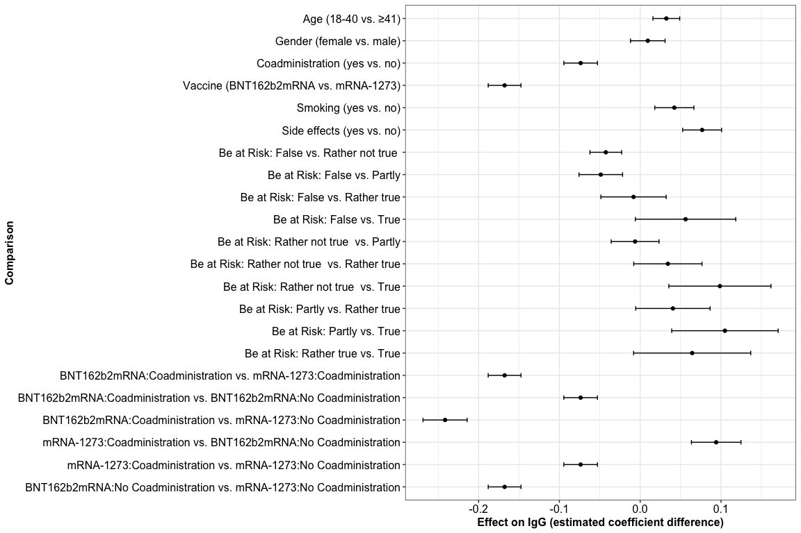<!-- -->

``` r
ggplot2::ggsave(plot = last_plot(), filename = file.path(plot.dir, "png", "Regression_model_mean_se_estimates.png"), device = "png",  width = 10, height = 12, dpi = 300)
ggplot2::ggsave(plot = last_plot(), filename = file.path(plot.dir, "svg", "Regression_model_mean_se_estimates.svg"), device = "svg",  width = 10, height = 12, dpi = 300)
```

## Comparison IgG titres based on vaccination concept

``` r
# Coadmin
gr_matrix <- as.data.frame(t(combn(levels(df_test$coadmin), 2)))
colnames(gr_matrix) <- c("group1", "group2")
                           
gr_count <- df_test %>% group_by(coadmin) %>% count() 

stat.comp <- gr_matrix %>% full_join(gr_count, by = c("group1" = "coadmin"), suffix = c("1", "2")) %>% 
             inner_join(gr_count, by = c("group2" = "coadmin"), suffix = c("1", "2")) %>% 
             mutate(contrast = paste0(group1, " - ", group2)) %>% 
             inner_join(post_hoc_comp %>% select(contrast, p.value, p.adj)) %>% mutate(".y." = "IgG")

stat.comp <- stat.comp %>% rstatix::add_significance() %>% filter(p.adj < 0.05) %>% rstatix::add_x_position()
box_upper <- df_test %>% group_by(coadmin) %>% summarise(igg_max = quantile(x = 10^logIgG, probs = 0.995))
stat.comp <- stat.comp %>% inner_join(box_upper, by = c("group1" = "coadmin")) %>% rename(ygr1 = igg_max) %>% inner_join(box_upper, by = c("group2" = "coadmin"))  %>% rename(ygr2 = igg_max)

stat.comp <- stat.comp %>% group_by(group1, group2) %>%
  mutate(diff_comp = xmax - xmin,
         ymax = round(log10(max(ygr1, ygr2)), 2)) %>%
  arrange(diff_comp, ymax) %>% group_by(diff_comp, ymax) %>%
  mutate(id = cur_group_id()) %>% as.data.frame()


# Vaccine + Coadmin
gr_matrix <- as.data.frame(t(combn(x = c("BNT162b2mRNA Coadministration", "mRNA-1273 Coadministration", "BNT162b2mRNA No Coadministration", "mRNA-1273 No Coadministration"), m = 2)))
colnames(gr_matrix) <- c("group1", "group2")

gr_count <- df_test %>% mutate(`vaccine:coadmin` = paste0(vaccine," ", coadmin)) %>% group_by(`vaccine:coadmin`) %>% count() 

stat.comp <- gr_matrix %>% full_join(gr_count, by = c("group1" = "vaccine:coadmin"), suffix = c("1", "2")) %>% 
             inner_join(gr_count, by = c("group2" = "vaccine:coadmin"), suffix = c("1", "2")) %>% 
             mutate(contrast = paste0(group1, " - ", group2)) %>% 
             inner_join(post_hoc_comp %>% select(contrast, p.value, p.adj)) %>% mutate(".y." = "IgG")

stat.comp <- stat.comp %>% rstatix::add_significance() %>% filter(p.adj < 0.05) %>% rstatix::add_x_position()
box_upper <- df_test %>% mutate(`vaccine:coadmin` = paste0(vaccine," ", coadmin)) %>% group_by(`vaccine:coadmin`) %>% summarise(igg_max = quantile(x = 10^logIgG, probs = 0.995))
stat.comp <- stat.comp %>% inner_join(box_upper, by = c("group1" = "vaccine:coadmin")) %>% rename(ygr1 = igg_max) %>% inner_join(box_upper, by = c("group2" = "vaccine:coadmin"))  %>% rename(ygr2 = igg_max)

stat.comp <- stat.comp %>% group_by(group1, group2) %>%
  mutate(diff_comp = xmax - xmin,
         ymax = round(log10(max(ygr1, ygr2)), 2)) %>%
  arrange(diff_comp, ymax) %>% group_by(diff_comp, ymax) %>%
  mutate(id = cur_group_id()) %>% as.data.frame()

stat.comp <- stat.comp %>% mutate(xmin = case_when(xmin <= 2 ~  0.8 + (xmin-1) * 0.4,
                                     xmin > 2 ~   1 + (xmin-1) * 0.4),
                    xmax = case_when(xmax <= 2 ~  0.8 + (xmax-1) * 0.4,
                                     xmax > 2 ~   1 + (xmax-1) * 0.4))

bx_plt <- df_test %>% mutate(`vaccine:coadmin` = paste0(vaccine," ", coadmin)) %>% 
  ggplot2::ggplot(ggplot2::aes(x = vaccine, y = 10^logIgG, fill = `vaccine:coadmin`)) +
  ggplot2::stat_boxplot(geom = "errorbar", lwd = 1, show.legend = FALSE, width = 0.4, position = position_dodge(width = 0.8)) +
  ggplot2::geom_boxplot(aes(x = vaccine, y = 10^logIgG, fill = `vaccine:coadmin`), width = 0.8, color = "black", lwd = 1, show.legend = FALSE, outlier.size = 0) +
  ggbeeswarm::geom_quasirandom(dodge.width=.75, alpha = 0.8,  pch = 20, size = 0.5) +
  ggplot2::theme_bw() +
  ggplot2::scale_fill_manual(labels = rep(c("Coadministration", "No Coadministration"), times = 2), values = c("#42B540FF", "darkgreen", "#ED0000FF", "darkred")) + 
  ggplot2::theme(axis.text = ggplot2::element_text(size = 17, colour = "black"),
                 axis.title = ggplot2::element_text(face = "bold", size = 16),
                 legend.title = ggplot2::element_blank(),
                 legend.text = ggplot2::element_text(size = 16),
                 legend.position = "bottom") +
  ggplot2::ylab("Anti-SARS-CoV-2-Spike IgG [BAU/ml]") +
  ggplot2::scale_y_log10(limits = c(10, 70000), breaks = 10^(0:4), labels = format(10^(0:4), scientific = F)) +
  ggplot2::annotation_logticks(sides = "l") +
  ggplot2::xlab("") +
  # ggplot2::geom_hline(yintercept = 31.5, lty = 2) +
  ggsignif::geom_signif(xmin = stat.comp$xmin,
                        xmax = stat.comp$xmax,
                        y_position = 0.1 * 1.4^(seq_along(stat.comp$ymax)) + (stat.comp$ymax),
                        annotation = stat.comp$p.adj.signif,
                        tip_length = 0.01, vjust = 0.75, lwd = 0.75, textsize = 7) + 
  ggplot2::guides(fill = ggplot2::guide_legend(override.aes = list(shape = 22, size = 8, stroke = 1), ncol = 2))

bx_plt
```

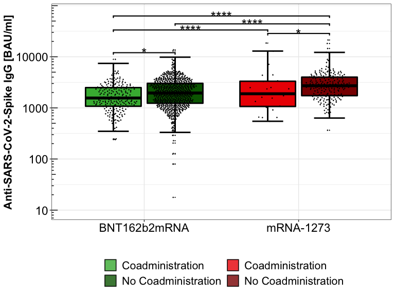<!-- -->

``` r
ggplot2::ggsave(plot = bx_plt, filename = file.path(plot.dir, "png", "Boxplot_coadministration_comparison.png"), device = "png",  width = 8, height = 6, dpi = 300)

ggplot2::ggsave(plot = bx_plt, filename = file.path(plot.dir, "svg", "Boxplot_coadministration_comparison.svg"), device = "svg",  width = 8, height = 6, dpi = 300)
```

## Comparison influential factors

``` r
plot_vars <- c("AgeCategory", "gender", "smoking", "sideeffects", "risk")

tick_labels <- list(Age = c("18-40", "41+"),
                    Gender = c("female", "male"),
                    Smoking = c("smoker", "non-smoker"),
                    "Side effects" =  c("yes", "no"),
                    "Be at Risk" = c("False", "Rather not true ", "Partly", "Rather true", "True")
                    )
plot_list <- list()

for(i in seq_along(plot_vars)){
  
    gr_matrix <- as.data.frame(t(combn(levels(df_test[[plot_vars[i]]]), 2)))
    colnames(gr_matrix) <- c("group1", "group2")
                           
    gr_count <- df_test %>% group_by(!!sym(plot_vars[i])) %>% count() 

    stat.comp <- gr_matrix %>% full_join(gr_count, by = c("group1" = plot_vars[i]), suffix = c("1", "2")) %>% 
                 inner_join(gr_count, by = c("group2" = plot_vars[i]), suffix = c("1", "2")) %>% 
                 mutate(contrast = paste0(group1, " - ", group2)) %>% 
                 inner_join(post_hoc_comp %>% select(comparison, contrast, p.value, p.adj) %>% filter(grepl(pattern = names(tick_labels)[i], x = comparison))) %>% mutate(".y." = "IgG")
    
    stat.comp <- stat.comp %>% rstatix::add_significance() %>% filter(p.adj < 0.05) %>% rstatix::add_x_position()
    box_upper <- df_test %>% group_by(!!sym(plot_vars[i])) %>% summarise(igg_max = quantile(x = IgG, probs = 0.995))

    stat.comp <- stat.comp %>% inner_join(box_upper, by = c("group1" = plot_vars[i])) %>% rename(ygr1 = igg_max) %>% 
      inner_join(box_upper, by = c("group2" = plot_vars[i]))  %>% rename(ygr2 = igg_max)

    stat.comp <- stat.comp %>% group_by(group1, group2) %>%
                 mutate(diff_comp = xmax - xmin,
                        ymax = round(log10(max(ygr1, ygr2)), 2)) %>%
                 arrange(diff_comp, ymax) %>% group_by(diff_comp, ymax) %>%
                 mutate(id = cur_group_id()) %>% as.data.frame()

    cat('### Comparison: ', unique(as.character(stat.comp$comparison)), '\n')
    
    bx_plt <- df_test %>% ggplot2::ggplot(ggplot2::aes_string(x = plot_vars[i], y = "IgG")) +
      ggplot2::stat_boxplot(geom = "errorbar", lwd = 1, width = 0.5, show.legend = FALSE) +
      ggplot2::geom_boxplot(aes_string(fill = plot_vars[i]), color = "black", lwd = 1, show.legend = FALSE, outlier.size = 0) +
      ggbeeswarm::geom_quasirandom(alpha = 0.8, width = 0.4, pch = 20, size = 0.5) +
      ggplot2::scale_y_log10() +
      ggplot2::theme_bw() +
      ggsci::scale_fill_lancet() +
      ggplot2::scale_x_discrete(labels = tick_labels[[i]])+
      ggplot2::theme(axis.text = ggplot2::element_text(size = 14, colour = "black"),
                     axis.title = ggplot2::element_text(face = "bold", size = 12),
                     legend.title = ggplot2::element_blank(),
                     legend.text = ggplot2::element_text(size = 12),
                     legend.position = "none") +
      ggplot2::xlab(names(tick_labels)[i]) +
      ggplot2::ylab("Anti-SARS-CoV-2-Spike IgG [BAU/ml]") +
      ggplot2::annotation_logticks(sides = "l") 
      # ggplot2::geom_hline(yintercept = 31.5, lty = 2)

    if(dim(stat.comp)[1] > 0 ){

      box_upper <- df_test %>% group_by(!!sym(plot_vars[i])) %>% summarise(igg_max = quantile(x = IgG, probs = 0.995))

      
      if(df_test %>% pull(!!sym(plot_vars[i])) %>% unique() %>% length() > 2){

        stat.comp <- stat.comp %>% group_by(group1, group2) %>%
          mutate(diff_comp = xmax - xmin,
                 ymax = round(log10(max(ygr1, ygr2)), 2),
                 p_val = p.adj.signif) %>%
          arrange(diff_comp, ymax) %>% group_by(diff_comp, ymax) %>%
          mutate(id = cur_group_id()) %>% as.data.frame()
      }else{

        stat.comp <- stat.comp %>% group_by(group1, group2) %>%
          mutate(diff_comp = xmax - xmin,
                 ymax = round(log10(max(ygr1, ygr2)), 2),
                 p_val = p.adj.signif) %>%
          arrange(diff_comp, ymax) %>% group_by(diff_comp, ymax) %>%
          mutate(id = cur_group_id()) %>% as.data.frame()

      }

      bx_plt <-  bx_plt + ggsignif::geom_signif(xmin = stat.comp$group1,
                                                xmax = stat.comp$group2,
                                                y_position = 0.175 * seq_along(stat.comp$ymax) + (stat.comp$ymax),
                                                annotation = stat.comp$p.adj.signif,
                                                tip_length = 0.01, vjust = 0.75, lwd = 0.75, textsize = 7)
    }

    plot_list[[i]] <- bx_plt
}

## Generate combined plot for confounding factors associated to IgG titres

plot_list[[1]] <- plot_list[[1]] + 
                  ggplot2::xlab("") + 
                  ggsci::scale_fill_jco() + 
                  ggplot2::facet_wrap(~., labeller = ggplot2::as_labeller(c(`(all)` = "Age [Years]"))) + 
                  ggplot2::theme(axis.title.x = ggplot2::element_blank(),
                                 strip.text = ggplot2::element_text(size = 14, face = "bold"), 
                                 strip.background = ggplot2::element_rect(fill = "white"))
plot_list[[2]] <- plot_list[[2]] + 
                  ggplot2::xlab("") + 
                  ggplot2::facet_wrap(~., labeller = ggplot2::as_labeller(c(`(all)` = "Gender"))) + 
                  ggplot2::theme(axis.title = ggplot2::element_blank(),
                                 strip.text = ggplot2::element_text(size = 14, face = "bold"), 
                                 strip.background = ggplot2::element_rect(fill = "white"))
plot_list[[3]] <- plot_list[[3]] + 
                  ggplot2::xlab("") + 
                  ggsci::scale_fill_jama() + 
                  ggplot2::facet_wrap(~., labeller = ggplot2::as_labeller(c(`(all)` = "Smoking"))) + 
                  ggplot2::theme(axis.title = ggplot2::element_blank(),
                                 strip.text = ggplot2::element_text(size = 14, face = "bold"), 
                                 strip.background = ggplot2::element_rect(fill = "white"))
plot_list[[4]] <- plot_list[[4]] + 
                  ggplot2::xlab("") + 
                  ggsci::scale_fill_lancet() + 
                  ggplot2::facet_wrap(~., labeller = ggplot2::as_labeller(c(`(all)` = "Side effects"))) + 
                  ggplot2::theme(axis.title = ggplot2::element_blank(),
                                 strip.text = ggplot2::element_text(size = 14, face = "bold"), 
                                 strip.background = ggplot2::element_rect(fill = "white"))
plot_list[[5]] <- plot_list[[5]] + 
                  ggplot2::xlab("") + 
                  ggsci::scale_fill_jco() + 
                  ggplot2::facet_wrap(~., labeller = ggplot2::as_labeller(c(`(all)` = "Be at Risk"))) + 
                  ggplot2::theme(axis.title.x= ggplot2::element_blank(),
                                 strip.text = ggplot2::element_text(size = 14, face = "bold"), 
                                 strip.background = ggplot2::element_rect(fill = "white"))

comb_plt_top <- cowplot::plot_grid(plotlist = plot_list[1:3], ncol = 3, rel_widths = c(0.31, 0.3, 0.3), labels = LETTERS[1:3], label_size = 16)
comb_plt_bottom <- cowplot::plot_grid(plotlist = plot_list[5:4], ncol = 2, rel_widths = c(0.61, 0.3), labels = LETTERS[4:5], label_size = 16)


comb_plt <- cowplot::plot_grid(comb_plt_top, comb_plt_bottom, nrow = 2, ncol = 1)

comb_plt
```

<!-- -->

``` r
ggplot2::ggsave(plot = comb_plt, filename = file.path(plot.dir, "png", "Boxplot_other_categorical_factors.png"), device = "png",  width = 12, height = 8, dpi = 300)
ggplot2::ggsave(plot = comb_plt, filename = file.path(plot.dir, "png/Combined_boxplotsl.png"), 
                device = "png",  width = 12, height = 8, dpi = 300)

ggplot2::ggsave(plot = comb_plt, filename = file.path(plot.dir, "svg", "Boxplot_other_categorical_factors.svg"), device = "svg",  width = 12, height = 8, dpi = 300)
ggplot2::ggsave(plot = comb_plt, filename = file.path(plot.dir, "svg/Combined_boxplotsl.svg"), 
                device = "svg",  width = 12, height = 8, dpi = 300)
```

## Days between vaccination and serum sampling

``` r
pred_int <- predict(gls_mod, interval = "prediction") 
pred_time_igg <- cbind(df_test %>% select(logIgG, time_serum_coadmin), Prediction = pred_int)

y_hat_igg <- predict(gls_mod, interval = "prediction") 
rsquare_cv <- cor(df_test$logIgG, y_hat_igg)^2

cor_time_igg <- round(cor(df_test$time_serum_coadmin, df_test$logIgG, method = "spearman"), 2)

line_plt_time <- df_test %>%
  ggplot2::ggplot(ggplot2::aes(x = time_serum_coadmin, y = IgG)) +
  ggplot2::geom_point(size = 1, alpha = 0.75) +
  ggplot2::scale_y_log10(limits = c(10, 30000), expand = c(0,0)) +
  ggplot2::geom_smooth(data = pred_time_igg, ggplot2::aes(x = time_serum_coadmin, y = 10^Prediction), method = "lm") +
  ggsci::scale_color_lancet() +
  ggplot2::scale_x_continuous(breaks = seq(0,90,15), labels = seq(0,90,15)) +
  ggplot2::theme_bw() +
  ggplot2::theme(axis.text = ggplot2::element_text(size = 14, colour = "black"),
                 axis.title = ggplot2::element_text(face = "bold", size = 12),
                 legend.title = ggplot2::element_blank(),
                 legend.text = ggplot2::element_text(size = 16),
                 legend.position = "bottom") +
  ggplot2::xlab("Days since vaccination") +
  ggplot2::ylab("Anti-SARS-CoV-2-Spike IgG [BAU/ml]") +
  ggplot2::annotation_logticks(sides = "l") +
  ggplot2::annotate(geom = "text", label = paste0("italic(c)== ", cor_time_igg), x = 50, y = 10000, cex = 5, parse = TRUE, hjust = 0) + 
  ggplot2::annotate(geom = "text", label = paste0("italic(p) ", anova_gls$p_plot[7]), x = 50, y = 13000, cex = 5, parse = TRUE, hjust = 0) 

line_plt_time
```

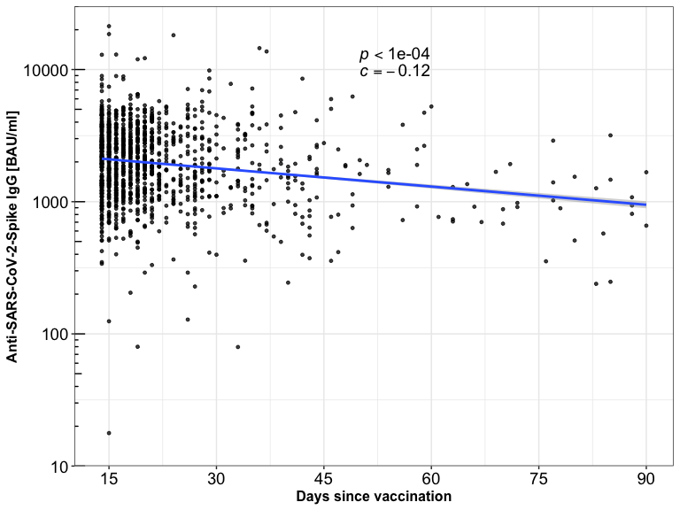<!-- -->

``` r
ggplot2::ggsave(plot = line_plt_time, filename = file.path(plot.dir, "png/Scatterplot_time_serum.png"), 
                device = "png",  width = 8, height = 6, dpi = 300)
ggplot2::ggsave(plot = line_plt_time, filename = file.path(plot.dir, "svg/Scatterplot_time_serum.svg"), 
                device = "svg",  width = 8, height = 6, dpi = 300)
```

# Side effects

## Coadministration irrespective of vaccination

### Table: Fisher test results

``` r
fisher_tests_coad <- fisher_tests_gr(df = df_coad, gr1 = "coadmin", var_expr = "se[1-6]")

p.adj_fisher_tests_coad <- cbind(fisher_tests_coad[,-c(9,10)], "p.adjusted" = round(p.adjust(fisher_tests_coad$p.value, "BY"), 2))

knitr::kable(p.adj_fisher_tests_coad, align = "c") %>%
    kableExtra::kable_styling(full_width = F, position = "left")%>%
    kableExtra::column_spec(1, bold = T) %>%
    kableExtra::collapse_rows(columns = 4:9, valign = "middle")
```

<table class="table" style="width: auto !important; ">
<thead>
<tr>
<th style="text-align:center;">
group1
</th>
<th style="text-align:center;">
group2
</th>
<th style="text-align:center;">
gr2.1
</th>
<th style="text-align:center;">
gr2.2
</th>
<th style="text-align:center;">
estimate
</th>
<th style="text-align:center;">
p.value
</th>
<th style="text-align:center;">
conf.low
</th>
<th style="text-align:center;">
conf.high
</th>
<th style="text-align:center;">
p.adjusted
</th>
</tr>
</thead>
<tbody>
<tr>
<td style="text-align:center;font-weight: bold;">
Coadministration
</td>
<td style="text-align:center;">
se1
</td>
<td style="text-align:center;">
149
</td>
<td style="text-align:center;">
100
</td>
<td style="text-align:center;vertical-align: middle !important;" rowspan="2">
0.9126640
</td>
<td style="text-align:center;vertical-align: middle !important;" rowspan="2">
0.5596714
</td>
<td style="text-align:center;vertical-align: middle !important;" rowspan="2">
0.6806514
</td>
<td style="text-align:center;vertical-align: middle !important;" rowspan="2">
1.2269668
</td>
<td style="text-align:center;vertical-align: middle !important;" rowspan="2">
1.00
</td>
</tr>
<tr>
<td style="text-align:center;font-weight: bold;">
No Coadministration
</td>
<td style="text-align:center;">
se1
</td>
<td style="text-align:center;">
609
</td>
<td style="text-align:center;">
373
</td>
</tr>
<tr>
<td style="text-align:center;font-weight: bold;">
Coadministration
</td>
<td style="text-align:center;">
se2
</td>
<td style="text-align:center;">
93
</td>
<td style="text-align:center;">
156
</td>
<td style="text-align:center;vertical-align: middle !important;" rowspan="2">
0.7814688
</td>
<td style="text-align:center;vertical-align: middle !important;" rowspan="2">
0.0984122
</td>
<td style="text-align:center;vertical-align: middle !important;" rowspan="2">
0.5798145
</td>
<td style="text-align:center;vertical-align: middle !important;" rowspan="2">
1.0493465
</td>
<td style="text-align:center;vertical-align: middle !important;" rowspan="2">
0.92
</td>
</tr>
<tr>
<td style="text-align:center;font-weight: bold;">
No Coadministration
</td>
<td style="text-align:center;">
se2
</td>
<td style="text-align:center;">
425
</td>
<td style="text-align:center;">
557
</td>
</tr>
<tr>
<td style="text-align:center;font-weight: bold;">
Coadministration
</td>
<td style="text-align:center;">
se3
</td>
<td style="text-align:center;">
85
</td>
<td style="text-align:center;">
164
</td>
<td style="text-align:center;vertical-align: middle !important;" rowspan="2">
0.7232706
</td>
<td style="text-align:center;vertical-align: middle !important;" rowspan="2">
0.0300151
</td>
<td style="text-align:center;vertical-align: middle !important;" rowspan="2">
0.5334901
</td>
<td style="text-align:center;vertical-align: middle !important;" rowspan="2">
0.9758017
</td>
<td style="text-align:center;vertical-align: middle !important;" rowspan="2">
0.56
</td>
</tr>
<tr>
<td style="text-align:center;font-weight: bold;">
No Coadministration
</td>
<td style="text-align:center;">
se3
</td>
<td style="text-align:center;">
410
</td>
<td style="text-align:center;">
572
</td>
</tr>
<tr>
<td style="text-align:center;font-weight: bold;">
Coadministration
</td>
<td style="text-align:center;">
se4
</td>
<td style="text-align:center;">
65
</td>
<td style="text-align:center;">
184
</td>
<td style="text-align:center;vertical-align: middle !important;" rowspan="2">
0.8430940
</td>
<td style="text-align:center;vertical-align: middle !important;" rowspan="2">
0.3090158
</td>
<td style="text-align:center;vertical-align: middle !important;" rowspan="2">
0.6053320
</td>
<td style="text-align:center;vertical-align: middle !important;" rowspan="2">
1.1642561
</td>
<td style="text-align:center;vertical-align: middle !important;" rowspan="6">
1.00
</td>
</tr>
<tr>
<td style="text-align:center;font-weight: bold;">
No Coadministration
</td>
<td style="text-align:center;">
se4
</td>
<td style="text-align:center;">
290
</td>
<td style="text-align:center;">
692
</td>
</tr>
<tr>
<td style="text-align:center;font-weight: bold;">
Coadministration
</td>
<td style="text-align:center;">
se5
</td>
<td style="text-align:center;">
119
</td>
<td style="text-align:center;">
130
</td>
<td style="text-align:center;vertical-align: middle !important;" rowspan="2">
0.8234485
</td>
<td style="text-align:center;vertical-align: middle !important;" rowspan="2">
0.1778373
</td>
<td style="text-align:center;vertical-align: middle !important;" rowspan="2">
0.6169598
</td>
<td style="text-align:center;vertical-align: middle !important;" rowspan="2">
1.0982951
</td>
</tr>
<tr>
<td style="text-align:center;font-weight: bold;">
No Coadministration
</td>
<td style="text-align:center;">
se5
</td>
<td style="text-align:center;">
517
</td>
<td style="text-align:center;">
465
</td>
</tr>
<tr>
<td style="text-align:center;font-weight: bold;">
Coadministration
</td>
<td style="text-align:center;">
se6
</td>
<td style="text-align:center;">
32
</td>
<td style="text-align:center;">
217
</td>
<td style="text-align:center;vertical-align: middle !important;" rowspan="2">
0.8311161
</td>
<td style="text-align:center;vertical-align: middle !important;" rowspan="2">
0.4222212
</td>
<td style="text-align:center;vertical-align: middle !important;" rowspan="2">
0.5330110
</td>
<td style="text-align:center;vertical-align: middle !important;" rowspan="2">
1.2651649
</td>
</tr>
<tr>
<td style="text-align:center;font-weight: bold;">
No Coadministration
</td>
<td style="text-align:center;">
se6
</td>
<td style="text-align:center;">
148
</td>
<td style="text-align:center;">
834
</td>
</tr>
</tbody>
</table>

### Plot: Odds Ratios

``` r
fisher_plot_odds(fisher_test_df = fisher_tests_coad, ylab_add = "coadministration")
```

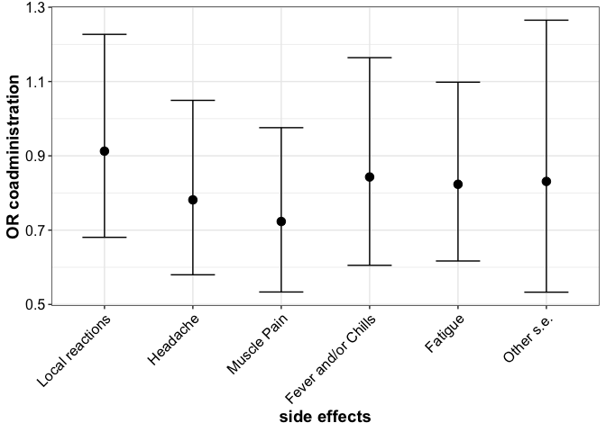<!-- -->

``` r
ggplot2::ggsave(plot = last_plot(), filename = file.path(plot.dir, "png/Side_effects_OR_only_coadmin.png"), 
                device = "png",  width = 8, height = 6, dpi = 300)

ggplot2::ggsave(plot = last_plot(), filename = file.path(plot.dir, "svg/Side_effects_OR_only_coadmin.svg"), 
                device = "svg",  width = 8, height = 6, dpi = 300)
```

### BarPlot - Pairwise Comparisons

``` r
barplot_sideeffects_percentage(p.adj_fisher_tests_df = p.adj_fisher_tests_coad)
```

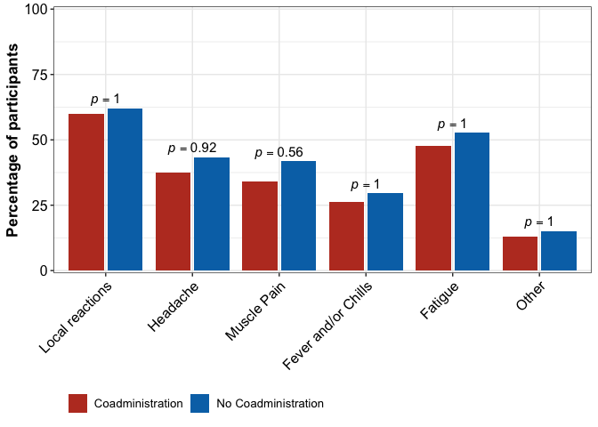<!-- -->

``` r
ggplot2::ggsave(plot = last_plot(), filename = file.path(plot.dir, "png/Side_effects_Barplot_percentage_only_coadmin.png"), 
                device = "png",  width = 8, height = 6, dpi = 300)

ggplot2::ggsave(plot = last_plot(), filename = file.path(plot.dir, "svg/Side_effects_Barplot_percentage_only_coadmin.svg"), 
                device = "svg",  width = 8, height = 6, dpi = 300)
```

## Coadministration regarding different COVID-19 vaccines

### Table: Fisher test results

``` r
fisher_tests_sep <- sapply(levels(df_coad$vaccine), function(vacc_name){
                          fisher_tests_gr(df = df_coad %>% filter(vaccine %in% vacc_name), gr1 = "coadmin", var_expr = "se[1-6]")
                    }, simplify = F)

df_vacc_sep <- data.frame(super_group = rep(levels(df_coad$vaccine), each = dim(fisher_tests_sep[[1]])[1]), do.call("rbind", fisher_tests_sep))
df_vacc_sep_p_adj <- cbind(df_vacc_sep, "p.adjusted" = round(p.adjust(df_vacc_sep$p.value, "BY"), 2))

knitr::kable(df_vacc_sep_p_adj[,-c(1,10,11)], align = "l", row.names = F) %>%
    kableExtra::collapse_rows(columns = 6:9) %>%
    kableExtra::pack_rows("BNT162b2mRNA", 1, 12) %>%
    kableExtra::pack_rows("mRNA-1273", 13, 24) %>%
    kableExtra::kable_styling(full_width = F, position = "left")%>%
    kableExtra::column_spec(1, bold = T)
```

<table class="table" style="width: auto !important; ">
<thead>
<tr>
<th style="text-align:left;">
group1
</th>
<th style="text-align:left;">
group2
</th>
<th style="text-align:left;">
gr2.1
</th>
<th style="text-align:left;">
gr2.2
</th>
<th style="text-align:left;">
estimate
</th>
<th style="text-align:left;">
p.value
</th>
<th style="text-align:left;">
conf.low
</th>
<th style="text-align:left;">
conf.high
</th>
<th style="text-align:left;">
p.adjusted
</th>
</tr>
</thead>
<tbody>
<tr grouplength="12">
<td colspan="9" style="border-bottom: 1px solid;">
<strong>BNT162b2mRNA</strong>
</td>
</tr>
<tr>
<td style="text-align:left;padding-left: 2em;font-weight: bold;" indentlevel="1">
Coadministration
</td>
<td style="text-align:left;">
se1
</td>
<td style="text-align:left;">
137
</td>
<td style="text-align:left;">
88
</td>
<td style="text-align:left;">
0.9862146
</td>
<td style="text-align:left;vertical-align: middle !important;" rowspan="2">
0.9381564
</td>
<td style="text-align:left;vertical-align: middle !important;" rowspan="2">
0.7199510
</td>
<td style="text-align:left;vertical-align: middle !important;" rowspan="2">
1.355247
</td>
<td style="text-align:left;vertical-align: middle !important;" rowspan="24">
1
</td>
</tr>
<tr>
<td style="text-align:left;padding-left: 2em;font-weight: bold;" indentlevel="1">
No Coadministration
</td>
<td style="text-align:left;">
se1
</td>
<td style="text-align:left;">
472
</td>
<td style="text-align:left;">
299
</td>
<td style="text-align:left;">
0.9862146
</td>
</tr>
<tr>
<td style="text-align:left;padding-left: 2em;font-weight: bold;" indentlevel="1">
Coadministration
</td>
<td style="text-align:left;">
se2
</td>
<td style="text-align:left;">
82
</td>
<td style="text-align:left;">
143
</td>
<td style="text-align:left;">
0.8437421
</td>
<td style="text-align:left;vertical-align: middle !important;" rowspan="2">
0.3138048
</td>
<td style="text-align:left;vertical-align: middle !important;" rowspan="2">
0.6118310
</td>
<td style="text-align:left;vertical-align: middle !important;" rowspan="2">
1.158685
</td>
</tr>
<tr>
<td style="text-align:left;padding-left: 2em;font-weight: bold;" indentlevel="1">
No Coadministration
</td>
<td style="text-align:left;">
se2
</td>
<td style="text-align:left;">
312
</td>
<td style="text-align:left;">
459
</td>
<td style="text-align:left;">
0.8437421
</td>
</tr>
<tr>
<td style="text-align:left;padding-left: 2em;font-weight: bold;" indentlevel="1">
Coadministration
</td>
<td style="text-align:left;">
se3
</td>
<td style="text-align:left;">
75
</td>
<td style="text-align:left;">
150
</td>
<td style="text-align:left;">
0.7641390
</td>
<td style="text-align:left;vertical-align: middle !important;" rowspan="2">
0.1014027
</td>
<td style="text-align:left;vertical-align: middle !important;" rowspan="2">
0.5505391
</td>
<td style="text-align:left;vertical-align: middle !important;" rowspan="2">
1.054709
</td>
</tr>
<tr>
<td style="text-align:left;padding-left: 2em;font-weight: bold;" indentlevel="1">
No Coadministration
</td>
<td style="text-align:left;">
se3
</td>
<td style="text-align:left;">
305
</td>
<td style="text-align:left;">
466
</td>
<td style="text-align:left;">
0.7641390
</td>
</tr>
<tr>
<td style="text-align:left;padding-left: 2em;font-weight: bold;" indentlevel="1">
Coadministration
</td>
<td style="text-align:left;">
se4
</td>
<td style="text-align:left;">
52
</td>
<td style="text-align:left;">
173
</td>
<td style="text-align:left;">
0.8084375
</td>
<td style="text-align:left;vertical-align: middle !important;" rowspan="2">
0.2626709
</td>
<td style="text-align:left;vertical-align: middle !important;" rowspan="2">
0.5586435
</td>
<td style="text-align:left;vertical-align: middle !important;" rowspan="2">
1.156728
</td>
</tr>
<tr>
<td style="text-align:left;padding-left: 2em;font-weight: bold;" indentlevel="1">
No Coadministration
</td>
<td style="text-align:left;">
se4
</td>
<td style="text-align:left;">
209
</td>
<td style="text-align:left;">
562
</td>
<td style="text-align:left;">
0.8084375
</td>
</tr>
<tr>
<td style="text-align:left;padding-left: 2em;font-weight: bold;" indentlevel="1">
Coadministration
</td>
<td style="text-align:left;">
se5
</td>
<td style="text-align:left;">
105
</td>
<td style="text-align:left;">
120
</td>
<td style="text-align:left;">
0.8593869
</td>
<td style="text-align:left;vertical-align: middle !important;" rowspan="2">
0.3255030
</td>
<td style="text-align:left;vertical-align: middle !important;" rowspan="2">
0.6307151
</td>
<td style="text-align:left;vertical-align: middle !important;" rowspan="2">
1.169750
</td>
</tr>
<tr>
<td style="text-align:left;padding-left: 2em;font-weight: bold;" indentlevel="1">
No Coadministration
</td>
<td style="text-align:left;">
se5
</td>
<td style="text-align:left;">
389
</td>
<td style="text-align:left;">
382
</td>
<td style="text-align:left;">
0.8593869
</td>
</tr>
<tr>
<td style="text-align:left;padding-left: 2em;font-weight: bold;" indentlevel="1">
Coadministration
</td>
<td style="text-align:left;">
se6
</td>
<td style="text-align:left;">
26
</td>
<td style="text-align:left;">
199
</td>
<td style="text-align:left;">
0.7937022
</td>
<td style="text-align:left;vertical-align: middle !important;" rowspan="2">
0.3759011
</td>
<td style="text-align:left;vertical-align: middle !important;" rowspan="2">
0.4821740
</td>
<td style="text-align:left;vertical-align: middle !important;" rowspan="2">
1.267975
</td>
</tr>
<tr>
<td style="text-align:left;padding-left: 2em;font-weight: bold;" indentlevel="1">
No Coadministration
</td>
<td style="text-align:left;">
se6
</td>
<td style="text-align:left;">
109
</td>
<td style="text-align:left;">
662
</td>
<td style="text-align:left;">
0.7937022
</td>
</tr>
<tr grouplength="12">
<td colspan="8" style="border-bottom: 1px solid;">
<strong>mRNA-1273</strong>
</td>
</tr>
<tr>
<td style="text-align:left;padding-left: 2em;font-weight: bold;" indentlevel="1">
Coadministration
</td>
<td style="text-align:left;">
se1
</td>
<td style="text-align:left;">
12
</td>
<td style="text-align:left;">
12
</td>
<td style="text-align:left;">
0.5416226
</td>
<td style="text-align:left;vertical-align: middle !important;" rowspan="2">
0.1807878
</td>
<td style="text-align:left;vertical-align: middle !important;" rowspan="2">
0.2107962
</td>
<td style="text-align:left;vertical-align: middle !important;" rowspan="2">
1.390668
</td>
</tr>
<tr>
<td style="text-align:left;padding-left: 2em;font-weight: bold;" indentlevel="1">
No Coadministration
</td>
<td style="text-align:left;">
se1
</td>
<td style="text-align:left;">
137
</td>
<td style="text-align:left;">
74
</td>
<td style="text-align:left;">
0.5416226
</td>
</tr>
<tr>
<td style="text-align:left;padding-left: 2em;font-weight: bold;" indentlevel="1">
Coadministration
</td>
<td style="text-align:left;">
se2
</td>
<td style="text-align:left;">
11
</td>
<td style="text-align:left;">
13
</td>
<td style="text-align:left;">
0.7348089
</td>
<td style="text-align:left;vertical-align: middle !important;" rowspan="2">
0.5220536
</td>
<td style="text-align:left;vertical-align: middle !important;" rowspan="2">
0.2838994
</td>
<td style="text-align:left;vertical-align: middle !important;" rowspan="2">
1.868655
</td>
</tr>
<tr>
<td style="text-align:left;padding-left: 2em;font-weight: bold;" indentlevel="1">
No Coadministration
</td>
<td style="text-align:left;">
se2
</td>
<td style="text-align:left;">
113
</td>
<td style="text-align:left;">
98
</td>
<td style="text-align:left;">
0.7348089
</td>
</tr>
<tr>
<td style="text-align:left;padding-left: 2em;font-weight: bold;" indentlevel="1">
Coadministration
</td>
<td style="text-align:left;">
se3
</td>
<td style="text-align:left;">
10
</td>
<td style="text-align:left;">
14
</td>
<td style="text-align:left;">
0.7220896
</td>
<td style="text-align:left;vertical-align: middle !important;" rowspan="2">
0.5214102
</td>
<td style="text-align:left;vertical-align: middle !important;" rowspan="2">
0.2737143
</td>
<td style="text-align:left;vertical-align: middle !important;" rowspan="2">
1.837775
</td>
</tr>
<tr>
<td style="text-align:left;padding-left: 2em;font-weight: bold;" indentlevel="1">
No Coadministration
</td>
<td style="text-align:left;">
se3
</td>
<td style="text-align:left;">
105
</td>
<td style="text-align:left;">
106
</td>
<td style="text-align:left;">
0.7220896
</td>
</tr>
<tr>
<td style="text-align:left;padding-left: 2em;font-weight: bold;" indentlevel="1">
Coadministration
</td>
<td style="text-align:left;">
se4
</td>
<td style="text-align:left;">
13
</td>
<td style="text-align:left;">
11
</td>
<td style="text-align:left;">
1.8914402
</td>
<td style="text-align:left;vertical-align: middle !important;" rowspan="2">
0.1861765
</td>
<td style="text-align:left;vertical-align: middle !important;" rowspan="2">
0.7420222
</td>
<td style="text-align:left;vertical-align: middle !important;" rowspan="2">
4.908946
</td>
</tr>
<tr>
<td style="text-align:left;padding-left: 2em;font-weight: bold;" indentlevel="1">
No Coadministration
</td>
<td style="text-align:left;">
se4
</td>
<td style="text-align:left;">
81
</td>
<td style="text-align:left;">
130
</td>
<td style="text-align:left;">
1.8914402
</td>
</tr>
<tr>
<td style="text-align:left;padding-left: 2em;font-weight: bold;" indentlevel="1">
Coadministration
</td>
<td style="text-align:left;">
se5
</td>
<td style="text-align:left;">
14
</td>
<td style="text-align:left;">
10
</td>
<td style="text-align:left;">
0.9081904
</td>
<td style="text-align:left;vertical-align: middle !important;" rowspan="2">
0.8288735
</td>
<td style="text-align:left;vertical-align: middle !important;" rowspan="2">
0.3559063
</td>
<td style="text-align:left;vertical-align: middle !important;" rowspan="2">
2.400739
</td>
</tr>
<tr>
<td style="text-align:left;padding-left: 2em;font-weight: bold;" indentlevel="1">
No Coadministration
</td>
<td style="text-align:left;">
se5
</td>
<td style="text-align:left;">
128
</td>
<td style="text-align:left;">
83
</td>
<td style="text-align:left;">
0.9081904
</td>
</tr>
<tr>
<td style="text-align:left;padding-left: 2em;font-weight: bold;" indentlevel="1">
Coadministration
</td>
<td style="text-align:left;">
se6
</td>
<td style="text-align:left;">
6
</td>
<td style="text-align:left;">
18
</td>
<td style="text-align:left;">
1.4674462
</td>
<td style="text-align:left;vertical-align: middle !important;" rowspan="2">
0.4200744
</td>
<td style="text-align:left;vertical-align: middle !important;" rowspan="2">
0.4470834
</td>
<td style="text-align:left;vertical-align: middle !important;" rowspan="2">
4.188326
</td>
</tr>
<tr>
<td style="text-align:left;padding-left: 2em;font-weight: bold;" indentlevel="1">
No Coadministration
</td>
<td style="text-align:left;">
se6
</td>
<td style="text-align:left;">
39
</td>
<td style="text-align:left;">
172
</td>
<td style="text-align:left;">
1.4674462
</td>
</tr>
</tbody>
</table>

### Plot: Odds Ratios

``` r
fisher_plot_odds(fisher_test_df = df_vacc_sep, ylab_add = "coadministration", wrap = T)
```

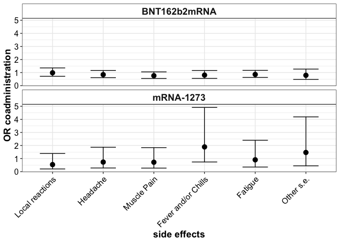<!-- -->

``` r
ggplot2::ggsave(plot = last_plot(), filename = file.path(plot.dir, "png/Side_effects_OR_coadmin_by_vaccine.png"), 
                device = "png",  width = 8, height = 8, dpi = 300)
ggplot2::ggsave(plot = last_plot(), filename = file.path(plot.dir, "svg/Side_effects_OR_coadmin_by_vaccine.svg"), 
                device = "svg",  width = 8, height = 8, dpi = 300)
```

### BarPlot - Pairwise Comparisons

``` r
barplot_sideeffects_percentage(p.adj_fisher_tests_df = df_vacc_sep_p_adj, wrap = T)
```

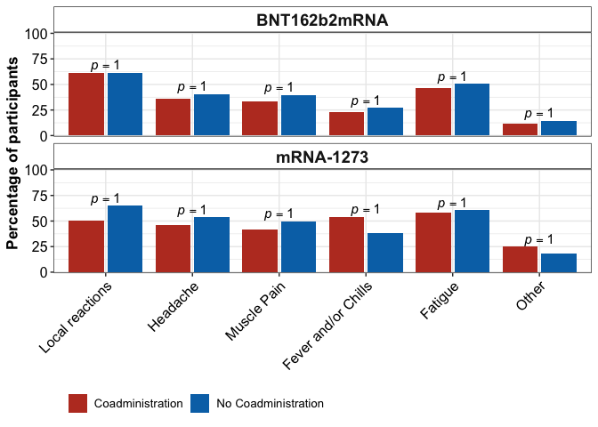<!-- -->

``` r
ggplot2::ggsave(plot = last_plot(), filename = file.path(plot.dir, "png/Side_effects_Barplot_percentage_coadmin_by_vaccine.png"), 
                device = "png",  width = 8, height = 8, dpi = 300)
ggplot2::ggsave(plot = last_plot(), filename = file.path(plot.dir, "svg/Side_effects_Barplot_percentage_coadmin_by_vaccine.svg"), 
                device = "svg",  width = 8, height = 8, dpi = 300)
```
